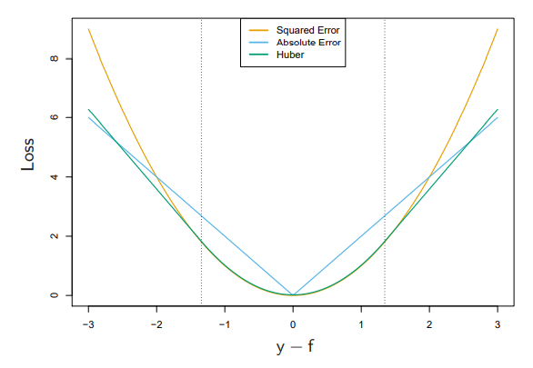
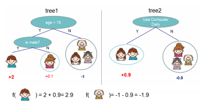

# Theory {#theory}

## The powerful idea of gradient boosting

As roughly mentioned in the introduction section \@ref(intro) the main idea of boosting is to sequentially build weak learners that form a powerful ensemble model. With weak learners models with high bias and low variance are meant that perform at least a little better than guessing. This already shows that the sequential approach of gradient boosting with weak learners stands in strong contrast to bagged ensembles like random forest. There many models with low bias and high variance are fitted in a parallel fashion and the variance is then reduced by averaging over the models.[@HandsOnMLwithR] It is not totally clear from which field boosting methods emerged but some claim that the work of Freund and Schapire with respect to PAC learning in the 1990s were instrumental for their growth.[@elements] PAC learning can be considered one field within the broader field of learning theory that tries to find generalization bounds for algorithms that are probably approximately correct (PAC).[@pacbounds] This section will first cover the general setup of gradient boosting as the most prominent method to train forward stagewise additive models. Secondly tree-based gradient boosting and finally a very efficient and robust tree-based gradient boosting algorithm namely XGBoost will be discussed in detail.

### Forward Stagewise Additive Modeling

In the setting of the data set $\mathcal{D} = \{(y_i,x_i)\ | i \in [N]\}$ with predictors $x_i \in \mathbb{R}^m$ and target $y_i \in \mathbb{R}$ boosting is fitting the following additive, still quite general, model.

```{=tex}
\begin{equation}
  \hat{y_i} = \phi(x_i) = \sum_{k=1}^{K} f_k(x_i), \quad f_k \in \mathcal{F}
  (\#eq:additiveModel)
\end{equation}
```
Where $\mathcal{F}$ is the space of learning algorithms that will be narrowed down later on. Additive expansions like this are at the core of many other powerful machine learning algorithms like Neural Networks or Wavelets.[@elements]

The formulation \@ref(eq:additiveModel) leads to so called forward stagewise additive modeling which basically means that one sequentially adds $f \in \mathcal{F}$ to the current model $\phi_k$ without changing anything about the previous models.[@elements] The algorithm is shown below.

------------------------------------------------------------------------

**Algorithm 1**: Forward Stagewise Additive Modeling [@elements]

------------------------------------------------------------------------

1.  Initialize $\phi_0(x) = 0$

2.  For $k = 1$ to $K$ do:

    -   $(\beta_k,\gamma_k) = argmin_{\beta,\gamma}\sum_{i=1}^N L(y_i,\phi_{k-1}(x_i) + \beta f(x_i,\gamma))$
    -   $\phi_k(x) = \phi_{k-1}(x) + \beta_k f(x, \gamma_k)$

Where $\gamma$ parameterizes the learner $f \in \mathcal{F}$ and the $\beta_k$ are the expansion coefficients. $L$ should be a differentiable loss function.

------------------------------------------------------------------------

For example for the basic $L_2$ loss the expression to be minimized simplifies to the following:

$$
L_2(y_i,\phi_{k-1}(x_i) + \beta f(x_i,\gamma)) = (y_i - \phi_{k-1}(x_i) - \beta f(x_i,\gamma))^2
$$

As $y_i - \phi_{k-1}(x_i)$ is just the residual of the previous model, the next model that is added corresponds to the model that best approximates the residuals of the current model. Although the $L_2$ loss has many very nice properties like the above, it lacks robustness against outliers. Therefore two alternative losses for boosting in the regression setting are worth considering.

### Robust loss functions for regression

As the $L_2$ loss squares the residuals, observations with large absolute residuals are overly important in the minimization step. This effect can be reduced intuitively by just using the $L_1$ loss i.e. minimize over the sum over just the absolute residuals. To do this is indeed a valid approach and can reduce the influence of outliers greatly and thus make the final model more robust. Another good choice could be the **Huber** loss which tries to get the best of $L_1$ and $L_2$ loss.[@elements]

```{=tex}
\begin{equation}
  L_{Huber}(y,f(x)) = \begin{cases}L_2(y,f(x)) & |y-f(x)| \leq \delta \\
  2\delta |y-f(x)| - \delta^2 & otherwise.
  \end{cases}
  (\#eq:huberLoss)
\end{equation}
```
In Figure \@ref(fig:lossComp) is a comparison of the three different losses discussed so far.[@elements]

```{r lossComp,echo=FALSE,fig.dim=c(6,4), out.width='70%', fig.align='center', fig.cap="Comparison of different regression loss functions."}

```

These alternative loss criteria are more robust but make the fitting i.e. the minimization much more complex as they do not yield such simplifications like the $L_2$ loss.[@elements] The next step in the journey of exploring boosting is to narrow down the argument spaces of **Algorithm 1** (Forward Stagewise Additive Modeling) and to specify a subset of the general space of learning algorithms. This subset will be the space of Classification and Regression Tree (CART) models and in this case as the focus is on a regression task the space of regression trees. This choice is by no means arbitrary as in practice tree-based boosting algorithms have proven countless of times that they provide very robust and accurate models but still other learners might be chosen.[@elements, @HandsOnMLwithR] The next subsection will explore how one can actually fit such a forward stagewise additive model when using regression trees as the learner class.

## General gradient tree boosting

From now on there is the switch from the space of learning algorithms $\mathcal{F}$ to the space of regression trees $\mathcal{T}$. Such a regression tree can be formally expressed by:

```{=tex}
\begin{equation}
  t(x, \gamma, R) = \sum_{j=1}^J \gamma_j I(x \in R_j) \quad \text{for  } t \in \mathcal{T}
  (\#eq:treeDef)
\end{equation}
```
With $R_j$ being $J$ distinct regions of the predictor space usually attained by recursive binary splitting. Moreover these regions correspond to the leafs of the tree and the number of leafs $J$ or the depth of the trees are most often hyperparameters (not trained). The $\gamma_j \in \mathbb{R}$ are the predictions for a given x if x is contained in the region $R_j$. While it is quite easy to get the $\gamma_j$ for the regions given, most often by computing $\gamma_j = \frac{1}{|\{x \in R_j\}|} \sum_{\{x \in R_j\}} x$ , it is a much harder problem to get good distinct regions. The above mentioned recursive binary splitting is an approximation to do this and works in a top down greedy fashion.[@elements] From now on we assume that we have an efficient way of fitting such trees to a metric outcome variable e.g. by recursive binary splitting.

A nice graphical example of an additive model based on trees is displayed in the figure \@ref(fig:exampleAdditiveTree) below.[@xgboostPaper]

```{r exampleAdditiveTree,echo=FALSE,fig.height=4, out.width='70%', fig.align='center', fig.cap="Example of an additive tree ensamble."}

```

Having now the new space $\mathcal{T}$ for the general boosting model \@ref(eq:additiveModel) one can write down the optimization problem that has to be solved in each step of the forward stagewise process of fitting the model.

```{=tex}
\begin{equation}
  (\gamma^{(k)},R^{(k)}) = argmin_{\gamma,R} \sum_{i=1}^N L(y_i, \phi_{k-1}(x_i) + t(x_i,\gamma,R))
  (\#eq:oneStepTreeBoost)
\end{equation}
```
This can be estimated fast and quite straight forward if there is a simplification like the one seen for the $L_2$ loss. But in the more general case of an arbitrary differentiable convex loss function like the Huber loss techniques from numerical optimization are needed to derive fast algorithms.[@elements]

### Numerical optimization {#numOpt}

According to **Algorithm 1** the goal in order to fit the boosting model is to minimize over the full loss of the training data $\mathcal{D}$ which is the sum over all observation losses.

$$
L(\phi) = \sum_{i=1}^N L(y_i, \phi(x_i))
$$

And thus the $\hat{\phi}$ additive boosting model we try to get is the following.

$$
\hat{\phi} = argmin_{\phi} L(\phi)
$$

Now we basically follow the spirit of the general gradient descent algorithm for differentiable functions. In the general case we minimize a function $f(x)$ by stepping iteratively along the direction of the steepest descent i.e. the negative gradient. The step length can then either be a constant small scalar or be determined by a line search.

In the setting of the additive boosting model $\phi$ can be viewed as a vector of dimension $N$ that contains the prediction according to $\phi$ of the corresponding observation i.e. $\phi = (\phi(x_1),...,\phi(x_N))$. So the loss function $L(\phi)$ corresponds to the $f(x)$ in the general gradient descent algorithm. Numerical optimization, here gradient descent, then solves for $\hat{\phi}$ by a sum of vectors of the same dimension as the $\phi$.[@elements] The result of the sum $\phi_K$ (\@ref(eq:numOptSol)) can be viewed as the current proposal for the optimal $\hat{\phi}$ after $K$ optimization steps and each $h^{(k)}$ is the proposed improvement step.

```{=tex}
\begin{equation}
  \phi_K = \sum_{k=0}^K h^{(k)} \quad h^{(k)} \in \mathbb{R}^N 
  (\#eq:numOptSol)
\end{equation}
```
While $h^{(0)}$ is just an initial guess the subsequent $h^{(k)}$ are again the prediction vectors of the corresponding model out of $\mathcal{T}$ i.e. $h^{(k)}_{i} = t_k(x_i)$ with $t \in \mathcal{T}$. This means that each $\phi_k = \phi_{k-1} + h^{(k)}$. The $h^{(k)}$ are calculated via the gradient which finally comes into play. As mentioned above one minimizes the loss the most by going towards the direction of the steepest descent. For \@ref(eq:numOptSol) follows from its additive formulation and defining $g^{(k)}$ as the gradient of $L(\phi_k)$ evaluated for $\phi_{k-1}$ the update $h^{(k)} = -\lambda_k g^{(k)}$. As we assumed the loss to be differentiable we see that $g^{(k)}$ is well defined. Here $\lambda_k$ is the usual step length for gradient descent methods. It is the solution of the line search $\lambda_k = argmin_{\lambda} L(\phi_{k-1} - \lambda g^{(k)})$. This $\lambda_k$ almost exactly corresponds to the $\beta_k$ in **Algorithm 1** although here the optimization is performed for every region of the tree separately.[@elements]

With these insights it is clear that the tree predictions correspond to the negative gradient $-g^{(k)}$. Of course the predictions are not independent as the prediction is constant for each leaf of the tree. So the new optimization proposed by numerical optimization via gradient boosting is given in \@ref(eq:oneStepTreeBoostnew) below.

```{=tex}
\begin{equation}
  (\tilde{\gamma}^{(k)},\tilde{R}^{(k)}) = argmin_{\gamma,R} \sum_{i=1}^N [-g^{(k)}_{i} -  t(x_i,\gamma,R)] ^2
  (\#eq:oneStepTreeBoostnew)
\end{equation}
```
In words this just means fitting a regression tree by least squares to the negative gradients that were evaluated with the current predictions. The solution regions will not exactly match the ones from \@ref(eq:oneStepTreeBoost) but should be very similar.[@elements] After having estimated the regions one estimates the parameters $\gamma$ by solving the line search \@ref(eq:gammaLineSearch).

```{=tex}
\begin{equation}
  \tilde{\gamma}^{(k)}_{j} = argmin_{\gamma^{(k)}_{j}} \sum_{x \in R^{(k)}_{j}} L(y_i,\phi_{k-1}(x_i) + \gamma^{(k)}_{j})
  (\#eq:gammaLineSearch)
\end{equation}
```
Putting all of this back together with **Algorithm 1** results in **Algorithm 2** that covers a general algorithm for tree-based gradient boosting.

------------------------------------------------------------------------

**Algorithm 2**: Tree-based gradient boosting [@elements]

------------------------------------------------------------------------

1.  Initialize $\phi_0(x)$ as a singular node tree.

2.  For $k = 1$ to $K$ do:

    -   For $i = 1$ to $N$ compute:

        $g^{(k)}_{i} = \bigg[\frac{\partial L(y_i, \phi(x_i))}{\partial \phi(x_i)}\bigg]_{\phi = \phi_{k-1}}$

    -   Fit a regression tree by least squares to the outcome vector $-g^{(k)}$ in order to get the $J^{(k)}$ distinct regions $\tilde{R}^{(k)}_j$.

    -   For each of these $J^{(k)}$ regions perform a line search in order to compute the leaf predictions $\tilde{\gamma}^{(k)}_{j}$ exactly like in \@ref(eq:gammaLineSearch).

    -   Set $\phi_k(x) = \phi_{k-1}(x) + t(x,\tilde {\gamma}^{(k)}_{j},\tilde{R}^{(k)}_j)$ with $t \in \mathcal{T}$

------------------------------------------------------------------------

The only unknowns in this algorithm are now the differentiable loss function and the hyperparameters like the $J^{(k)}$ and the $K$. While choices for the hyperparameters are discussed further below, the following table \@ref(tab:lossGradients) displays the gradients for the losses discussed so far.

+--------------------------------+-----------------------------------------------------------------------------------------+
| Loss                           | Gradient                                                                                |
+================================+=========================================================================================+
| $L_2$: $(y_i - \phi(x_i))^2$   | $2(y_i - \phi(x_i))$                                                                    |
+--------------------------------+-----------------------------------------------------------------------------------------+
| $L_1$: $|y_i - \phi(x_i)|$     | $sign(y_i - \phi(x_i))$                                                                 |
+--------------------------------+-----------------------------------------------------------------------------------------+
| Huber loss \@ref(eq:huberLoss) | $y_i - \phi(x_i)$ for $|y_i - \phi(x_i)| \leq \delta$                                   |
|                                |                                                                                         |
|                                | $\delta sign(y_i - \phi(x_i))$ otherwise, with $\delta$ quantile of $|y_i - \phi(x_i)|$ |
+--------------------------------+-----------------------------------------------------------------------------------------+

: (\#tab:lossGradients) Gradients of the discussed losses [@elements]

### Single tree depth

The question which $J^{(k)}$ should be used at each iteration is now shortly discussed. Basically using the tree depth ($log_2(J^{(k)}) = Depth^{(k)}$) two means allowing only the main effects and no interactions. A value of 3 already allows all two way interaction effects and so on. As one stacks these models additive and does not restrict oneself to a single one, the building of a large tree and then pruning it back at each iteration as the regular CART algorithms do would be a computational overkill. Instead it has proven to be sufficient and efficient in practice to set the values $Depth^{(k)}$ to a constant $Depth \approx 6$.[@elements] Also decision stumps ($Depth = 1$) could be used but may require a lot more iterations.

### Combat overfitting {#combOver}

No learning algorithm could be fully covered without treating the good old problem of overfitting. In the setting of boosting the experienced eye could have spotted the problem of overfitting already in the definition of the additive model \@ref(eq:additiveModel). There the number $K$ of models that form the ensemble was introduced but was not discussed further till now. Of course one can arbitrarily fit or better say remember some given training data in order to minimize the loss with such an additive model by letting $K$ be arbitrarily large. This comes from the fact that the loss reduces usually after each iteration over $K$.[@elements] The easiest way to prevent overfitting is to have a validation set at hand which is disjoint from the training data. Having such a validation set at hand can be used to monitor the loss on the unseen data. In the case the loss would rise again on the validation data one can consider to stop the algorithm and to use the current iteration number for the final parameter $K$. This approach is often called early stopping. Besides that there are methods that regularize the individual trees that are fitted in each iteration. Two of those will be discussed now.

#### Shrinkage

Shrinkage basically refers to just introducing a learning rate $\eta$. This learning rate $\eta$ scales the contribution of the new model. In general the learning rate should be in $(0,1]$ but in practice it has been shown that rather small values like $\eta < 0.1$ work very good.[@elements] As almost everything in life this does not come for free. A smaller learning rate usually comes with a computational cost as with lower $\eta$ a larger $K$ is required. Those two hyperparameters represent a trade-off in a way. In practice it is advisable to use a small learning rate $\eta$ and adjust the $K$ accordingly which in this case would mean to make the $K$ large enough until one reaches an early stopping point. Still it is good to keep in mind that a $\eta$ that is too small can lead to an immense and unnecessary computational effort. All in all using shrinkage the update step in **Algorithm 2** changes to the following.

```{=tex}
\begin{equation}
  \phi_k(x) = \phi_{k-1}(x) + \eta * t(x,\tilde {\gamma}^{(k)}_{j},\tilde{R}^{(k)}_j)
  (\#eq:shrinkage)
\end{equation}
```
#### Subsampling

The other method to regularize the trees will be subsampling. There are two different kinds of subsampling. The first one is row-subsampling which basically means just using a random fraction of the training data in each iteration when fitting the new tree. Common values are $\frac{1}{2}$ but for a larger training set the value can be chosen to be smaller. This does not only help to prevent overfitting and thus achieving a better predictive performance but reduces also the computational effort in each iteration.[@elements] The approach is very similar to the dropout technique in the setting of deep neural networks.

Moreover one can apply column-subsampling or feature-subsampling. Here only a fraction of the features or an explicit number of the features are used in each iteration. This is the exact same method and intention as the one applied in random forest models. Again the technique not only boosts performance on unseen data but also reduces the computational time.[@xgboostPaper] Still it must be noted that by using one or both subsampling methods one introduces one or two additional hyperparameters to the model that have to be tuned.

Having the **Algorithm 2** for tree-based gradient boosting alongside some regularization techniques it is time to look at a very popular, efficient and powerful open source implementation.

## XGBoost a highly efficient implementation

The XGBoost algorithm is a highly scalable, efficient and successful implementation and optimization of **Algorithm 2** introduced by Chen and Guestrin in 2016.[@xgboostPaper, @HandsOnMLwithR] It has gained a lot of spotlight when it was integral for many winning submissions at kaggle machine learning challenges. In the following the most important tweaks that are proposed to **Algorithm 2** are covered.

### Regularized loss

Instead of just minimizing a convex and differentiable loss $L$ XGBoost minimizes the following regularized loss.[@xgboostPaper]

```{=tex}
\begin{equation}
  \begin{split}
  \mathcal{L}(\phi) = L(\phi) + \sum_{k=1}^K \Omega(t_k) \\
  \text{where } \Omega(t) = \nu J + \frac{1}{2} \lambda ||\gamma||^2 \quad t \in \mathcal{T}
  \end{split}
  (\#eq:regLoss)
\end{equation}
```
Here $J$ and $\gamma$ again parameterize the regression trees $t \in \mathcal{T}$ as defined in \@ref(eq:treeDef). As evident from the formula both hyperparameters $\nu$ and $\lambda$ favor when increased less complex models at each iteration. This is again a measure against overfitting.

This regularized objective leads to a slightly modified version of the minimization problem \@ref(eq:oneStepTreeBoost) that has to be solved in each iteration.

```{=tex}
\begin{equation}
  (\gamma^{(k)},R^{(k)}) = argmin_{\gamma,R} \sum_{i=1}^N L(y_i, \phi_{k-1}(x_i) + t(x_i,\gamma,R)) + \Omega(t(x_i,\gamma,R))
  (\#eq:oneStepXGBoost)
\end{equation}
```
Instead of the first order approach, that has been introduced in \@ref(numOpt), XGBoost uses a second order approximation to further simplify the objective. This means that besides the first order gradient $g^{(k)}$ of the loss function evaluated at $\phi_{k-1}$ also the second order gradient $z^{(k)}_i = \bigg[\frac{\partial^2 L(y_i, \phi(x_i))}{\partial^2 \phi(x_i)}\bigg]_{\phi = \phi_{k-1}}$ is used. By neglecting constants one reaches the approximate new objective below.[@xgboostPaper]

```{=tex}
\begin{equation}
\begin{split}
  \tilde{\mathcal{L}}^{(k)} & = \sum_{i=1}^N [g^{(k)}_i t^{(k)}(x_i) + \frac{1}{2} t^{(k)}(x_i)^2] + \Omega(t^{(k)}) \\
  & = \sum_{j=1}^J [(\sum_{\{i|x_i \in R^{(k)}_j\}} g^{(k)}_i) \gamma^{(k)}_j + \frac{1}{2} (\sum_{\{i|x_i \in R^{(k)}_j\}} z^{(k)}_i + \lambda) (\gamma^{(k)}_j)^2 ] + \nu J
\end{split}
(\#eq:oneappStepXGBoost)
\end{equation}
```
This representation is used as it can be decomposed by the $J$ leafs of the tree. One can then define a scoring function for split finding that only depends on $g^{(k)}$ and $z^{(k)}$. This approach speeds up the split finding and allows further parallel computations with respect to the leafs.

### Shrinkage and subsampling

As discussed above in \@ref(combOver) shrinkage and subsampling are great ways to regularize the model and prevent overfitting. XGBoost implements both shrinkage and subsampling. It enables the user to use column as well as row subsampling. The authors claim that in practice column subsampling has prevented overfitting more than row subsampling.[@xgboostPaper]

### Even more tweaks

Besides the changes above the authors also implemented an effective approximate algorithm for split finding for the tree building step. A very nice attribute of this approximate procedure is that the algorithm is sparsity aware i.e. the processing of missing values or 0 values is very efficient. This is done via a learned default direction in each split. Moreover they used very efficient data structures to allow a lot of parallel processing.[@xgboostPaper] It is written in C++ but has APIs in various languages like in R via the `xgboost` package.[@xgboost_package]

### Hyperparameters overview

As the **tidymodels** framework will be used in the applied part, the according names from the parsnip interface for tree-based boosting i.e. `boost_tree` are discussed below.[@xgboostPaper, @xgboost_package, @tidymodels]

+------------------+---------------------+---------------------------------------------------------------------------------------------+
| Hyperparameter   | Notation above      | Meaning                                                                                     |
+==================+=====================+=============================================================================================+
| `trees`          | $K$                 | Number of trees in the ensemble.                                                            |
+------------------+---------------------+---------------------------------------------------------------------------------------------+
| `tree_depth`     | $max(log_2J^{(k)})$ | Maximum depth of the trees.                                                                 |
+------------------+---------------------+---------------------------------------------------------------------------------------------+
| `learn_rate`     | $\eta$              | Learning rate (shrinkage).                                                                  |
+------------------+---------------------+---------------------------------------------------------------------------------------------+
| `min_n`          |                     | Minimum number of observations in terminal region $R^{(k)}_j$.                              |
+------------------+---------------------+---------------------------------------------------------------------------------------------+
| `lambda`         | $\lambda$           | $L_2$ regularization parameter on $\gamma$ as in \@ref(eq:oneappStepXGBoost) (default = 0). |
+------------------+---------------------+---------------------------------------------------------------------------------------------+
| `alpha`          |                     | $L_1$ regularization parameter on $\gamma$ (default = 0).                                   |
+------------------+---------------------+---------------------------------------------------------------------------------------------+
| `loss_reduction` | $\nu$               | Minimal loss reduction for terminal partitions. (default = 0)                               |
+------------------+---------------------+---------------------------------------------------------------------------------------------+
| `mtry`           |                     | Proportion or number of columns for column subsampling.                                     |
+------------------+---------------------+---------------------------------------------------------------------------------------------+
| `sample_size`    |                     | Proportion of observations for row subsampling.                                             |
+------------------+---------------------+---------------------------------------------------------------------------------------------+
| `stop_iter`      |                     | Allowed number of rounds without improvement before early stopping.                         |
+------------------+---------------------+---------------------------------------------------------------------------------------------+

: (\#tab:xgboostHyper) XGBoost hyperparameters overview.

Note that the $L_1$ penalization term would be added to the $\Omega$ term in the loss $\mathcal{L}$ of XGBoost.

This closes the chapter on the theory of boosting methods with a focus on tree-based gradient boosting. The discussed tools will be put to the test in the subsequent sections where real world data will be analyzed with them.
