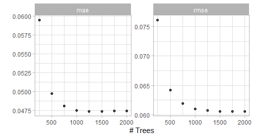
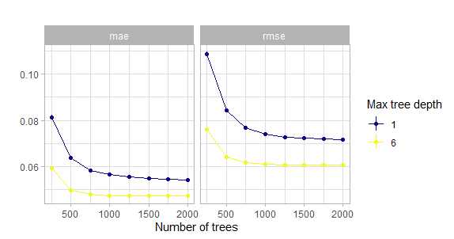
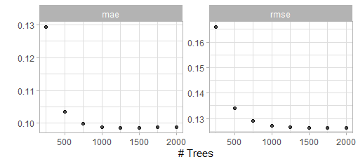
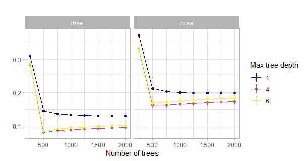
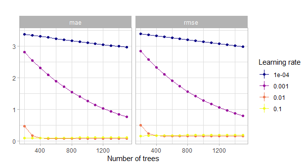
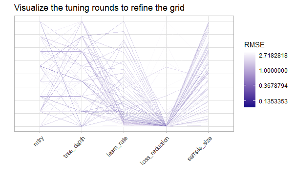
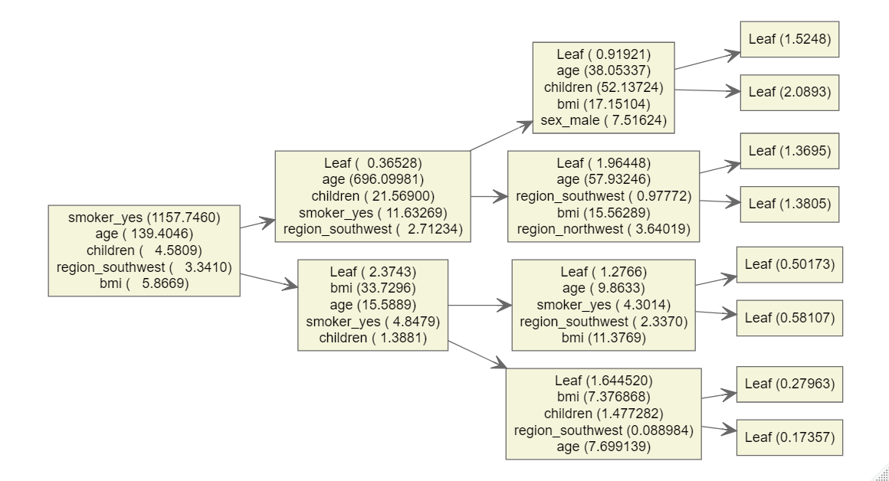

# Let's boost the models {#modeling}

Beside the XGBoost model also a random forest model will be fitted here for comparison. The whole modeling approach and procedure is closely following the principles that are outlined in the **great** book *Tidy modeling with R* by Max Kuhn and Julia Silge.

For the modeling three additional packages are required.[@xgboost_package; @ranger_package; @vipPack]

```{r loadModelPackages, message=FALSE, warning=FALSE}
library(xgboost) # for the xgboost model
library(ranger) # for the random forest model
# + the vip package but it will not be loaded into
# the namespace
```

For parallel computations the `doParallel` package is used.[@doParallel_package]
This is most useful for the tuning part.

```{r registerCLuster, eval=TRUE, warning=FALSE, message=FALSE}
library(doParallel)

# Create a cluster object and then register: 
cl <- makePSOCKcluster(2)
registerDoParallel(cl)


```

First one has to set a **metric** for the evaluation of the final performance. As one knows from the EDA that not a lot of outliers are present in the data one can leave the default for XGBoost as the optimization metric for regression which is the root mean squared error (RMSE) which basically corresponds to the $L_2$ loss. Besides also the mean average error (MAE) which is kind of the $L_1$ norm will be covered but the optimization and tuning will focus on the RMSE.

## Burnout data

### Baseline models

The first thing is to set up the trivial **baseline models**.

```{r}
# the trivial intercept only model:
bout_predict_trivial_mean <- function(new_data) {
  rep(mean(burnout_train$burn_rate), nrow(new_data))
}

# the trivial scoring of mental fatigue score (if missing intercept model)
bout_predict_trivial_mfs <- function(new_data) {
  # these two scoring parameters are correspondint to the 
  # simple linear regression model containing only one predictor
  # i.e. mfs
  pred <- new_data[["mental_fatigue_score"]] * 0.097 - 0.1
  pred[is.na(pred)] <- mean(burnout_train$burn_rate)
  pred
}

```

The predictions of these baseline models on the test data set will be compared with the predictions of the tree-based models that will be constructed.

### Model specification

```{r modelSpecburn}
# Models:

# Random forest model for comparison
bout_rf_model <- rand_forest(trees = tune(),
                             mtry = tune()) %>% 
  set_engine("ranger") %>% 
  set_mode("regression")

# XGBoost model 
bout_boost_model <- boost_tree(trees = tune(),
                               learn_rate = tune(),
                               loss_reduction = tune(),
                               tree_depth = tune(),
                               mtry = tune(),
                               sample_size = tune(),
                               stop_iter = 10) %>%
  set_engine("xgboost") %>% 
  set_mode("regression")

```

```{r workflowSpecburn}
# Workflows: model + recipe

# Random Forest workflow
bout_rf_wflow <-
  workflow() %>%
  add_model(bout_rf_model) %>%
  add_recipe(burnout_rec_rf)

# XGBoost workflow with the untransformed target
bout_boost_wflow <-
  workflow() %>%
  add_model(bout_boost_model) %>%
  add_recipe(burnout_rec_boost)

# XGBoost workflow with the transformed target (empirical logit)
bout_boost_wflow_trans <-
  workflow() %>%
  add_model(bout_boost_model) %>%
  add_recipe(burnout_rec_boost_trans)
```


### Tuning

For the hyperparameter tuning one needs validation sets to monitor the models on unseen data. To do this 5-fold cross validation (CV) is used here.

```{r resamplingObjects}
# Create Resampling object
set.seed(2)
burnout_folds <- vfold_cv(burnout_train, v = 5)
```

Now adjust or check the hyperparameter ranges that the tuning will use. First the Random forest model.

```{r}
# Have a look at the hyperparameters that have to be tuned and finalize them
bout_rf_params <- bout_rf_wflow %>%
  parameters()

bout_rf_params 
```

This shows that the `mtry` hyperparameter has to be adjusted depending on the data. Moreover with the `dials::update` function one can manually set the ranges that should be used for tuning.

```{r}
# default range for tuning is 1 up to 2000 for the trees argument
# set the lower bound of the range to 100. Then finalize the
# parameters using the training data.
bout_rf_params <- bout_rf_params %>%
  update(trees = trees(c(100, 2000))) %>%
  finalize(burnout_train)
bout_rf_params
bout_rf_params %>% pull_dials_object("mtry")
bout_rf_params %>% pull_dials_object("trees")
```

Now this parameter object is ready for tuning and the same steps have to be performed on the main boosting workflow. The parameter set for the untransformed target can then also be used for the transformed one.

```{r}
bout_boost_params <- bout_boost_wflow %>%
  parameters()

bout_boost_params 
```

```{r}
# first a look at the default ranges
trees()
tree_depth()
learn_rate()
loss_reduction()
sample_size()
```

So `sample_size` must also be finalized. Again the lower bound on the number of trees will be raised to 100. The other scales are really sensible and will be left as is.

```{r}
bout_boost_params <- bout_boost_params %>%
  update(trees = trees(c(100, 2000))) %>%
  finalize(burnout_train)

bout_boost_params
bout_boost_params %>%
  pull_dials_object("sample_size")
bout_boost_params %>%
  pull_dials_object("mtry")
# use the same object for the tuning of the boosted model
# with the transformed target
bout_boost_params_trans <- bout_boost_params
```

Now also these parameter objects are ready to be used. The next step is to define the metrics used for evaluation while tuning.


```{r}
# define a metrics set used for evaluation of the hyperparameters
regr_metrics <- metric_set(rmse, mae)
```

Now the actual tuning begins. The models will be tuned by a space filling grid search. As one has defined ranges for each parameter one can then use different algorithms to construct a grid of combinations of parameter values that tries to best fill the defined ranges by random sampling also in a high dimensional setting. In the following the function `tune::grid_latin_hypercube` is used for this. So basically one tries out all hyperparameter values for each fold and saves the performance of the performance metrics on the hold out fold. These metrics are then aggregated for each combination and with the resulting estimates of performance one can choose the final set of hyperparameters. The more hyperparameters the model has the more tuning rounds might be needed to refine the grid. Besides the classical grid search there are also iterative methods for tuning. These are mainly good to tune a single hyperparameter at once and not for a bunch of them simultaneously. They will not be used in the following.

The **random forest model** goes first with the tuning.

Here there are as seen above only two hyperparameters to be tuned thus 30 combinations should suffice.

```{r tuneRFburnout, cache=TRUE, eval=FALSE}
# took roughly 30 minutes
system.time({
  set.seed(2)
  bout_rf_tune <- bout_rf_wflow %>%
    tune_grid(
      resamples =  burnout_folds,
      grid = bout_rf_params %>%
        grid_latin_hypercube(size = 30, original = FALSE),
      metrics = regr_metrics
    )
})

# visualization of the tuning results (snapshot of the output below)
autoplot(bout_rf_tune) + theme_light()
# this functions shows the best combinations wrt the rmse metric of all the
# combinations in the grid
show_best(bout_rf_tune, metric = "rmse")
```


```{r rfburntuneplot,echo=FALSE,fig.height=4, out.width='70%', fig.align='center', fig.cap="Result of a spacefilling grid search for the random forest model."}
knitr::include_graphics("_pictures/rf_burn_tune_plot.png")
```

The visualization alongside the best performing results suggest that a value of `mtry`of 3 and 1000 `trees` should give good results. Thus one can finalize and fit this model.

```{r}
final_bout_rf_wflow <- 
  bout_rf_wflow %>% 
  finalize_workflow(tibble(
    trees = 1000,
    mtry = 3
  )) %>%
  fit(burnout_train)
```

Now the main **boosting model**.

First tune only the number of trees in order to detect a number of
trees that is 'large enough'. Then tune the tree specific arguments.
If one tunes all parameters at the same time the grid grows to large. Moreover a tuning of the trees argument could encourage overfitting. See the book *Hands-on Machine Learning with R* for a detailed explenation of the tuning strategies.[@HandsOnMLwithR]

The first tuning round:

To display the discussed impact of different maximum tree depths the first grid search for a good number of trees will besides the kind of standard value 6 also be performed for regression stumps i.e. a value of 1 for the maximum tree depth.

```{r}
# tuning grid just for the #trees one with max tree depth 6 and one with
# only stumps for comparison
first_grid_boost_burn_depth6 <- crossing(
  trees = seq(250, 2000, 250),
  mtry = 9,
  tree_depth = 6,
  loss_reduction = 0.000001,
  learn_rate = 0.01,
  sample_size = 1
)

first_grid_boost_burn_stumps <- crossing(
  trees = seq(250, 2000, 250),
  mtry = 9,
  tree_depth = 1,
  loss_reduction = 0.000001,
  learn_rate = 0.01,
  sample_size = 1
)
```

```{r tuneBoostBurnfirststumps, eval=FALSE, cache=TRUE}
# took roughly 1 minute
system.time({
  set.seed(2)
  bout_boost_tune_first_stumps <- bout_boost_wflow %>%
    tune_grid(
      resamples =  burnout_folds,
      grid = first_grid_boost_burn_stumps,
      metrics = regr_metrics
    )
})


autoplot(bout_boost_tune_first_stumps) + theme_light()
show_best(bout_boost_tune_first_stumps)
```

```{r tuneBoostBurnfirst6, eval=FALSE, cache=TRUE}
# took roughly 1 minute
system.time({
  set.seed(2)
  bout_boost_tune_first_depth6 <- bout_boost_wflow %>%
    tune_grid(
      resamples =  burnout_folds,
      grid = first_grid_boost_burn_depth6,
      metrics = regr_metrics
    )
})

# plot output is shown in the figure below
autoplot(bout_boost_tune_first_depth6) + theme_light()
show_best(bout_boost_tune_first_depth6)
```

```{r boostburntuneplot1,echo=FALSE,fig.height=4, out.width='70%', fig.align='center', fig.cap="Result of the first grid search for the XGBoost model (max depth 6)."}

```

Compare the two different first tuning rounds:

```{r, eval=FALSE}
# output of this code shown in the figure below
bout_boost_tune_first_stumps %>%
  collect_metrics() %>%
  mutate(tree_depth = 1) %>%
  bind_rows(
    bout_boost_tune_first_depth6 %>%
      collect_metrics() %>%
      mutate(tree_depth = 6)
  ) %>%
  ggplot(aes(x = trees, y = mean, col = factor(tree_depth))) +
  geom_point() +
  geom_line() +
  geom_linerange(aes(ymin = mean - std_err, ymax = mean + std_err)) +
  labs(col = "Max tree depth", y = "", x = "Number of trees",
       title = "") +
  scale_color_viridis_d(option = "C") +
  facet_wrap(~ .metric) +
  theme_light()
```

```{r bouttuningstumpsVs6,echo=FALSE,fig.height=4, out.width='70%', fig.align='center', fig.cap="Comparison of the initial grid search for the number of trees w.r.t. the maximum tree depth. Actually with tiny confidence bands around the estimates."}

```

This shows that the model with just stumps converges much slower or may even never reach the low level of when using deeper trees. One reason for this could be that these stumps do not account for interactions and of course the same number of deep trees encode much more information than the same number of stumps.


So 1500 trees should suffice here. Thus the workflow and model will be adjusted accordingly.

```{r}
# fix the number of trees by redefining the boosted model with a 
# fixed number of trees.
bout_boost_model <- boost_tree(trees = 1500,
                               learn_rate = tune(),
                               loss_reduction = tune(),
                               tree_depth = tune(),
                               mtry = tune(),
                               sample_size = tune(),
                               stop_iter = 10) %>%
  set_engine("xgboost") %>% 
  set_mode("regression")

# update the workflow
bout_boost_wflow <-
  bout_boost_wflow %>%
  update_model(bout_boost_model)

bout_boost_params <- bout_boost_wflow %>%
  parameters() %>%
  finalize(burnout_train)

# reduced hyperparameter space
bout_boost_params
```


Now perform the first major grid search over all the other hyperparameters.

```{r tuneBoostBurnsecond, eval=FALSE, cache=TRUE}
# now tune all the remaining hyperparameters with a large space filling grid

# took roughly 1.5 hours
system.time({
  set.seed(2)
  bout_boost_tune_second <- bout_boost_wflow %>%
    tune_grid(
      resamples = burnout_folds,
      grid = bout_boost_params %>%
        grid_latin_hypercube(
          size = 200),
      metrics = regr_metrics
    )
})

show_best(bout_boost_tune_second, metric = "rmse")
```

Now refine the grid i.e. the parameter space according to the results of the last grid search and perform a third one.

```{r tuneBoostBurnthird, eval=FALSE, cache=TRUE}
# now tune all the remaining hyperparameters with a refined space filling grid

# took roughly 2 hours
system.time({
  set.seed(2)
  bout_boost_tune_third <- bout_boost_wflow %>%
    tune_grid(
      resamples = burnout_folds,
      grid = bout_boost_params %>%
        update(
          mtry = mtry(c(5,9)),
          tree_depth = tree_depth(c(4,5)),
          learn_rate = learn_rate(c(-1.7, -1.3)),
          loss_reduction = loss_reduction(c(-8,-3)),
          sample_size = sample_prop(c(0.4, 0.9))
        ) %>%
        grid_latin_hypercube(
          size = 200),
      metrics = regr_metrics
    )
})

show_best(bout_boost_tune_third, metric = "rmse")

``` 

With this final grid search one is ready to finalize the model.

The results of the three grid searches suggest that no column-subsampling should be applied, the maximum tree depth should be 4, the learning rate should be small but not extremely small ($\sim 0.02$), the loss reduction regularization effect is not needed here (very small) and the sample size for each tree should be set to 0.8.

```{r}
final_bout_boost_wflow <- 
  bout_boost_wflow %>% 
  finalize_workflow(tibble(
    mtry = 9,
    tree_depth = 4,
    learn_rate = 0.02,
    loss_reduction = 0.0000003,
    sample_size = 0.8
  )) %>%
  fit(burnout_train)
```

Now tune the **transformed outcome boosting model**.

Again start with the `trees`.

```{r}
first_grid_boost_burn_trans <- crossing(
  trees = seq(250, 2000, 250),
  mtry = 9,
  tree_depth = 6,
  loss_reduction = 0.000001,
  learn_rate = 0.01,
  sample_size = 1
)
```

```{r tuneBoostBurnfirsttrans, eval=FALSE, cache=TRUE}
# took roughly 1 minute
system.time({
  set.seed(2)
  bout_boost_tune_first_trans <- bout_boost_wflow_trans %>%
    tune_grid(
      resamples =  burnout_folds,
      grid = first_grid_boost_burn_trans,
      metrics = regr_metrics
    )
})

# plot output in the figure below
autoplot(bout_boost_tune_first_trans) + theme_light()
show_best(bout_boost_tune_first_trans)
```

```{r burnboosttunefirsttrans,echo=FALSE,fig.height=4, out.width='70%', fig.align='center', fig.cap="Result of the first grid search for the XGBoost model with transformed outcome."}

```

Again 1500 trees should easily suffice.

```{r}
# fix the number of trees by redefining the boosted model with a 
# fixed number of trees.
bout_boost_model_trans <- boost_tree(trees = 1500,
                               learn_rate = tune(),
                               loss_reduction = tune(),
                               tree_depth = tune(),
                               mtry = tune(),
                               sample_size = tune(),
                               stop_iter = 10) %>%
  set_engine("xgboost") %>% 
  set_mode("regression")

# update the workflow
bout_boost_wflow_trans <-
  bout_boost_wflow_trans %>%
  update_model(bout_boost_model_trans)

bout_boost_params_trans <- bout_boost_wflow_trans %>%
  parameters() %>%
  finalize(burnout_train)

# reduced hyperparameter space
bout_boost_params_trans
```

Now perform the first major grid search over all the other hyperparameters and the second one overall.

```{r tuneBoostBurnsecondtrans, eval=FALSE, cache=TRUE}
# now tune all the remaining hyperparameters with a large space filling grid

# took roughly 2 hours
system.time({
  set.seed(2)
  bout_boost_tune_second_trans <- bout_boost_wflow_trans %>%
    tune_grid(
      resamples = burnout_folds,
      grid = bout_boost_params_trans %>%
        grid_latin_hypercube(
          size = 200),
      metrics = regr_metrics
    )
})

show_best(bout_boost_tune_second_trans, metric = "rmse")
```

From the tuning results one can conclude that in this setting actually the same hyperparameter setting as for the raw target variable seems appropriate. So one finalizes the workflow with the same hyperparameters and fits the model.


```{r}
final_bout_boost_wflow_trans <- 
  bout_boost_wflow_trans %>% 
  finalize_workflow(tibble(
    mtry = 9,
    tree_depth = 4,
    learn_rate = 0.02,
    loss_reduction = 0.0000003,
    sample_size = 0.8
  )) %>%
  fit(burnout_train)
```


Now all models w.r.t. the burnout data set are fitted.


### Evaluate and understand the model

First a visualization of the variable importance. The variable importance is basically calculated by measuring the gain w.r.t. the loss of each feature in the single trees and splits.[@elements]

**For a single tree**

The feature importance for the tree $t$ and the feature $X_l$ is given by:

$$
\mathcal{I}_l^2(t) = \sum_{j \in \{\text{Internal nodes}\}} \mathcal{i}_j^2\; I(\text{splitting variable}=X_l)
$$
Where $i_j^2$ is the estimated improvement in squared error of the split at node $j$ to stop splitting at this node.


**For the full ensemble**

$$
\mathcal{I}_l^2 = \frac{1}{K} \sum_{k = 1}^K \mathcal{I}_l^2(t_k)
$$

```{r, echo=TRUE, message=FALSE}
vip_burn <- final_bout_boost_wflow %>%
  pull_workflow_fit() %>%
  vip::vip() + 
  theme_light() +
  labs(title = "Variable importance of the XGBoost model")
vip_burn
ggsave("_pictures/vip_burn.png",plot = vip_burn)
remove(vip_burn)
```

This shows that indeed the `mental_fatigue_score` is the most influential predictor by far followed by the `ressource_allocation` and `designation` features. These results are not at all surprising as the EDA exactly came to these conclusions. Especially the very few appearances of the features connected to `company_type` and `date_of_joining` are most likely just some minor overfitting.

Now compare the variable importance of the model with the raw and the transformed target variable.

```{r, echo=FALSE}
raw_importance <- final_bout_boost_wflow %>%
  pull_workflow_fit() %>%
  vip::vip() + 
  theme_light() +
  labs(title = "Raw target")
trans_importance <- final_bout_boost_wflow_trans %>%
  pull_workflow_fit() %>%
  vip::vip() + 
  theme_light() +
  labs(title = "Transformed target")
raw_importance + trans_importance + plot_layout(guides = )
remove(raw_importance, trans_importance)
```

One can observe the exact same ordering. The only difference seems to be a higher influence of the designation variable for the transformed target. This is not surprising as the resource allocation and designation variable are highly correlated.

Now have a look at the performance of the main boosting model w.r.t. missing values in the most influential variable.


```{r, echo=TRUE, message=FALSE}
miss_vals_burn_no <- burnout_test %>%
  mutate(boost_pred = predict(final_bout_boost_wflow,
                              new_data = .)[[".pred"]]) %>%
  filter(!is.na(mental_fatigue_score)) %>%
  ggplot(aes(x = burn_rate, y = boost_pred)) +
  geom_point(col = plasma(1), alpha = 0.1, na.rm = TRUE) + 
  geom_abline(slope = 1, intercept = 0, size = 1) +
  xlim(0,1) + ylim(0,1) +
  theme_light() +
  labs(y = "XGBoost predictions",
       x = "True score",
       title = "XGBoost performance for non missing mental fatigue score") +
  coord_equal() +
  theme(plot.title = ggtext::element_markdown(size = 11))
miss_vals_burn_no
miss_vals_burn_yes <- burnout_test %>%
  mutate(boost_pred = predict(final_bout_boost_wflow,
                              new_data = .)[[".pred"]]) %>%
  filter(is.na(mental_fatigue_score)) %>%
  ggplot(aes(x = burn_rate, y = boost_pred)) +
  geom_point(col = plasma(1)) + 
  geom_abline(slope = 1, intercept = 0, size = 1) +
  xlim(0,1) + ylim(0,1) +
  theme_light() +
  labs(y = "XGBoost predictions",
       x = "True score",
       title = "XGBoost performance for missing mental fatigue score") +
  coord_equal() +
  theme(plot.title = ggtext::element_markdown(size = 11))
miss_vals_burn_yes
```

```{r, echo=FALSE, include=FALSE}
ggsave("_pictures/miss_vals_burn1.png", plot = miss_vals_burn_no)
ggsave("_pictures/miss_vals_burn2.png", plot = miss_vals_burn_yes)
remove(miss_vals_burn_no, miss_vals_burn_yes)
```


The performance for the missing values is indeed not that precise but still quite good. There is at least no huge outlier detectable here. While at first glance the fact that outliers are handled naturally by the model is not astonishing it really is one the core strengths of the model to deal with messy data that includes missing and sparse data. So there is no need for imputation or a second fallback model for missing values.


Now it is interesting to check which model performed the best on the test data set. The results can be viewed below in tabular and graphical form.


```{r perfBurn, echo=TRUE}
# calculate the mae and the rmse for all models (random forest and xgboost)
bout_test_perf <- burnout_test %>%
  mutate(rf_pred = predict(final_bout_rf_wflow,
                           new_data = .)[[".pred"]],
         boost_pred = predict(final_bout_boost_wflow,
                              new_data = .)[[".pred"]],
         boost_trans_pred = predict(final_bout_boost_wflow_trans,
                              new_data = .)[[".pred"]],
         # transform the predictions back
         boost_trans_pred = (2 / (exp(-boost_trans_pred) + 1)) - 0.5,
         intercept_pred = bout_predict_trivial_mean(.),
         mfs_scored_pred = bout_predict_trivial_mfs(.)) %>%
  mutate(across(ends_with("pred"), function(col) {
    case_when(
      col < 0 ~ 0,
      col > 1 ~ 1,
      TRUE ~ col
      )
  })) %>%
  select(burn_rate, rf_pred, boost_pred, boost_trans_pred,
         intercept_pred, mfs_scored_pred) %>%
  pivot_longer(-burn_rate, names_to = "model") %>%
  group_by(model) %>%
  summarise(
    mae = mae_vec(
      truth = burn_rate,
      estimate = value
    ),
    rmse = rmse_vec(
      truth = burn_rate,
      estimate = value
    )
  ) %>%
  arrange(rmse)

knitr::kable(bout_test_perf, digits = 4,
             booktabs = TRUE,
             caption = "Performance on the test data")
```

```{r, echo=FALSE, message=FALSE}
final_perf_burn <- bout_test_perf %>%
  pivot_longer(-model) %>%
  mutate(model = as.factor(model),
         model = fct_recode(model, 
                             "XGBoost" = "boost_pred",
                            "XGBoost transformed" = "boost_trans_pred",
                            "Random Forest" = "rf_pred",
                            "Baseline scaled" = "mfs_scored_pred",
                            "Intercept only" = "intercept_pred"),
         model = fct_reorder(model,-value)) %>%
  ggplot(aes(x = value, y = model, col = name)) +
  geom_point(shape = 16, size = 3) +
  geom_segment(aes(y = model, yend = model, 
                   x = 0, xend = value),
               size = 1) +
  scale_color_viridis_d(option = "C") +
  labs(x = "",y = "", title = "Performance on the test data") +
  theme_light() +
  theme(legend.position = "None") +
  facet_wrap(~name)
final_perf_burn
ggsave("_pictures/final_perf_burn.png",plot = final_perf_burn)
remove(final_perf_burn)
```


It can be observed that already the really simple baseline model that just scales the mental fatigue score (so it reflects just a single linear influence) has a really low MAE and RMSE. Still both random forest as well as the boosting model can further improve this metric but the huge linear influence of the mental fatigue score obviously leaves not much room for improvement. By the way the simple linear model with just this one predictor has already an $R^2$ of more than 0.92. XGBoost manages to get a slightly better performance on the test data set but this would only be nice in a machine learning competition as in real life this difference would negligible. Actually in this use case for a real life application a very easy explainable linear model might be somewhat better than a complex model like XGBoost as the difference in performance is not too big. Nevertheless in my opinion the predictor `mental_fatigue_score` should be treated with extreme care as in a real life situation the collection of this score could be as costly or hard as the one of the outcome. There might be even latent variables that are highly linearly correlated to both scores. But this data was not intended to be used in a real life application but was shared at a machine learning competition and actually many of the best submissions there used XGBoost models. The transformation of the outcome variable did actually not change the predictive power of the model as the result for both the model with the raw target as well as the one with the transformed one performed equally good. Below one can see a scatterplot comparing the individual predictions of these two models on the test set which perfectly underlines the hypothesis that the models are basically the same as there is almost no variation around the identity slope.

```{r, echo=FALSE, message=FALSE}
bout_raw_vs_trans <- burnout_test %>%
  mutate(boost_pred = predict(final_bout_boost_wflow,
                              new_data = .)[[".pred"]],
         boost_trans_pred = predict(final_bout_boost_wflow_trans,
                              new_data = .)[[".pred"]],
         boost_trans_pred = (2 / (exp(-boost_trans_pred) + 1)) - 0.5) %>%
  mutate(across(ends_with("pred"), function(col) {
    case_when(
      col < 0 ~ 0,
      col > 1 ~ 1,
      TRUE ~ col
      )
  })) %>%
  select(boost_pred, boost_trans_pred) %>%
  ggplot(aes(x = boost_pred, y = boost_trans_pred)) +
  geom_point(col = plasma(1), alpha = 0.1) +
  geom_abline() +
  xlim(0,1) + ylim(0,1) +
  coord_equal() +
  labs(x = "Raw target model", 
       y = "Transformed target model",
       title = "Predictions on the test data set") +
  theme_light()
bout_raw_vs_trans
ggsave("_pictures/bout_raw_vs_trans.png",plot = bout_raw_vs_trans)
remove(bout_raw_vs_trans)

```

So all in all for this data set it was not a way better predictive performance (if one is not in an artificial machine learning setup) that was the core strength of the tree-based gradient boosting model but the minimal pre-processing and exploratory work (for example no interactions have to be detected manually or be tested for significance) that was needed and the natural handling of missing values to achieve the model. This of course came to a quite high computational price. The famous predictive performance could probably be displayed better when having a data set with more complex non-linear patterns.


This finishes the analysis of the burnout data set. But no worries there is still one data set and boosting model left to explore namely the insurance data set.

## Insurance data

### Baseline models

The first thing is to set up the trivial **baseline models**.

```{r}
# the trivial intercept only model:
ins_predict_trivial_mean <- function(new_data) {
  rep(mean(ins_train$log10_charges), nrow(new_data))
}

# the trivial linear model without any interactions (as we do not have 
# missing values does not have to be dealt with them)
ins_baseline_lm <- lm(log10_charges ~ age + sex + bmi +
                        children + smoker + region,
                      data = ins_train %>% 
                        mutate(across(where(is.character), as.factor)))
summary(ins_baseline_lm)

```

The predictions of these baseline models on the test data set will be compared with the predictions of the tree-based models that will be constructed.


### Model specification

```{r modelSpecIns}
# Models:

# Random forest model for comparison
ins_rf_model <- rand_forest(trees = tune(),
                             mtry = tune()) %>% 
  set_engine("ranger") %>% 
  set_mode("regression")

# XGBoost model
ins_boost_model <- boost_tree(trees = tune(),
                               learn_rate = tune(),
                               loss_reduction = tune(),
                               tree_depth = tune(),
                               mtry = tune(),
                               sample_size = tune(),
                               stop_iter = 10) %>%
  set_engine("xgboost") %>% 
  set_mode("regression")
```

```{r workflowSpecIns}
# Workflows: model + recipe

ins_rf_wflow <-
  workflow() %>%
  add_model(ins_rf_model) %>%
  add_recipe(ins_rec_rf)

ins_boost_wflow <-
  workflow() %>%
  add_model(ins_boost_model) %>%
  add_recipe(ins_rec_boost)
```

### Tuning

For the hyperparameter tuning one needs validation sets to monitor the models on unseen data. To do this 5-fold cross validation (CV) is used here.

```{r resamplingObjectsIns}
# Create Resampling object
set.seed(2)
ins_folds <- vfold_cv(ins_train, v = 5)
```


Now the parameter objects will be fixed for the grid searches analogously to above.

```{r}
ins_rf_params <- ins_rf_wflow %>%
  parameters() %>%
  update(trees = trees(c(100, 2000))) %>%
  finalize(ins_train)
ins_rf_params %>% pull_dials_object("trees")
ins_rf_params %>% pull_dials_object("mtry")
```

```{r}
ins_boost_params <- ins_boost_wflow %>%
  parameters() %>%
  update(trees = trees(c(100, 2000))) %>%
  finalize(ins_train)
ins_boost_params
```

The **random forest model** goes first with the tuning.

Here there are as seen above only two hyperparameters to be tuned thus 30 combinations should suffice.

```{r tuneRFins, cache=TRUE, eval=FALSE}
# took roughly 2 minutes
system.time({
  set.seed(2)
  ins_rf_tune <- ins_rf_wflow %>%
    tune_grid(
      resamples =  ins_folds,
      grid = ins_rf_params %>%
        grid_latin_hypercube(size = 30, original = FALSE),
      metrics = regr_metrics
    )
})

# visualization of the tuning results (snapshot of the output below)
autoplot(ins_rf_tune) + theme_light()
# this functions shows the best combinations wrt the rmse metric of all the
# combinations in the grid
show_best(ins_rf_tune, metric = "rmse")
```


```{r rfInstuneplot,echo=FALSE,fig.height=4, out.width='70%', fig.align='center', fig.cap="Result of a spacefilling grid search for the random forest model."}
knitr::include_graphics("_pictures/rf_ins_tune_plot.png")
```

The visualization alongside the best performing results suggest that a value of `mtry`of 4 and 1000 `trees` should give good results. Thus one can finalize and fit this model.

```{r}
final_ins_rf_wflow <- 
  ins_rf_wflow %>% 
  finalize_workflow(tibble(
    trees = 1000,
    mtry = 4
  )) %>%
  fit(ins_train)
```

Now the **boosting model**.

Again one starts to tune over the number of trees first (this time we also use three different tree depths to visualize the impact of this parameter too)

```{r}
first_grid_boost_ins <- crossing(
  trees = seq(250, 2000, 250),
  mtry = 8,
  tree_depth = c(1, 4, 6),
  loss_reduction = 0.000001,
  learn_rate = 0.01,
  sample_size = 1
)
```

```{r tuneBoostInsfirst, eval=FALSE, cache=TRUE}
# took roughly half a minute
system.time({
  set.seed(2)
  ins_boost_tune_first <- ins_boost_wflow %>%
    tune_grid(
      resamples =  ins_folds,
      grid = first_grid_boost_ins,
      metrics = regr_metrics
    )
})


show_best(ins_boost_tune_first)
```


```{r, eval=FALSE}
# visualize the tuning results (output in the figure below)
ins_boost_tune_first %>%
  collect_metrics() %>%
  ggplot(aes(x = trees, y = mean, col = factor(tree_depth))) +
  geom_point() +
  geom_line() +
  geom_linerange(aes(ymin = mean - std_err, ymax = mean + std_err)) +
  labs(col = "Max tree depth", y = "", x = "Number of trees",
       title = "") +
  scale_color_viridis_d(option = "C") +
  facet_wrap(~ .metric) +
  theme_light()
```

```{r boostInstuneplot1,echo=FALSE,fig.height=4, out.width='70%', fig.align='center', fig.cap="Comparison of the initial grid search for the number of trees w.r.t. the maximum tree depth. Actually with tiny confidence bands around the estimates."}

```


This visualization clearly shows that one has to have a closer look at the region around 500 trees. More than 500 trees might lead to overfitting as seen here.

```{r}
second_grid_boost_ins <- crossing(
  trees = seq(250, 750, 50),
  mtry = 8,
  tree_depth = c(3, 4, 5, 6),
  loss_reduction = 0.000001,
  learn_rate = 0.01,
  sample_size = 1
)
```


```{r tuneBoostIns2, eval=FALSE, cache=TRUE}
# took roughly 15 seconds
system.time({
  set.seed(2)
  ins_boost_tune_second <- ins_boost_wflow %>%
    tune_grid(
      resamples =  ins_folds,
      grid = second_grid_boost_ins,
      metrics = regr_metrics
    )
})


show_best(ins_boost_tune_second)
```

```{r, eval=FALSE}
# visualize the tuning results (output in the figure below)
ins_boost_tune_second %>%
  collect_metrics() %>%
  ggplot(aes(x = trees, y = mean, col = factor(tree_depth))) +
  geom_point() +
  geom_line() +
  geom_linerange(aes(ymin = mean - std_err, ymax = mean + std_err)) +
  labs(col = "Max tree depth", y = "", x = "Number of trees",
       title = "") +
  scale_color_viridis_d(option = "C") +
  facet_wrap(~ .metric) +
  theme_light()
```

```{r boostInstuneplot2,echo=FALSE,fig.height=4, out.width='70%', fig.align='center', fig.cap="Comparison of the second grid search for the number of trees w.r.t. the maximum tree depth. Actually with tiny confidence bands around the estimates."}
knitr::include_graphics("_pictures/boost_ins_tune_plot2.png")
```

So from this visualization one can conclude that a number of trees of 600 should suffice to get a decent model. So the workflow will be updated and the number of trees fixed. After that the first major space filling grid search will be performed. Moreover with the previous visualizations in mind one can reduce the bound of the parameter space of the maximum tree depth quite a bit from 15 to 9. A minimum tree depth of 2 seems also appropriate. 
Before one does that mainly for a view on the influence of the learning rate one can tune one round only with the learning rate and some tree numbers for comparison.

```{r}
# tune mainly learn rate
lrate_grid_boost_ins <- crossing(
  trees = seq(200, 1500, 100),
  mtry = 8,
  tree_depth = c(3),
  loss_reduction = c(0.000001),
  learn_rate = c(0.1, 0.01, 0.001, 0.0001),
  sample_size = 1
)
```


```{r tuneBoostInslrate, eval=FALSE, cache=TRUE}
# took roughly 20 seconds
system.time({
  set.seed(2)
  ins_boost_tune_lrate <- ins_boost_wflow %>%
    tune_grid(
      resamples =  ins_folds,
      grid = lrate_grid_boost_ins,
      metrics = regr_metrics
    )
})


show_best(ins_boost_tune_lrate)
```


```{r, eval=FALSE}
# visualize the tuning results (output in the figure below)
ins_boost_tune_lrate %>%
  collect_metrics() %>%
  ggplot(aes(x = trees, y = mean, col = factor(learn_rate))) +
  geom_point() +
  geom_line() +
  geom_linerange(aes(ymin = mean - std_err, ymax = mean + std_err)) +
  labs(x = "Number of trees", y = "", col = "Learning rate",
       title = "") +
  scale_color_viridis_d(option = "C") +
  facet_wrap(~ .metric) +
  theme_light()
```

```{r boostInstuneplotlrate,echo=FALSE,fig.height=4, out.width='70%', fig.align='center', fig.cap="Comparison of the grid search for the number of trees w.r.t. the learning rate. Actually with tiny confidence bands around the estimates."}

```

This showcases the fact that indeed a learning rate that is too small can blow up the computational costs.

Now fix the number of the `trees` hyperparameter.

```{r}
# fix the number of trees by redefining the boostin model with a 
# fixed number of trees.
ins_boost_model <- boost_tree(trees = 600,
                               learn_rate = tune(),
                               loss_reduction = tune(),
                               tree_depth = tune(),
                               mtry = tune(),
                               sample_size = tune(),
                               stop_iter = 10) %>%
  set_engine("xgboost") %>% 
  set_mode("regression")

# update the workflow
ins_boost_wflow <-
  ins_boost_wflow %>%
  update_model(ins_boost_model)

ins_boost_params <- ins_boost_wflow %>%
  parameters() %>%
  update(tree_depth = tree_depth(c(2, 9))) %>%
  finalize(ins_train)

# reduced hyperparameter space
ins_boost_params
```


```{r tuneBoostIns3, eval=FALSE, cache=TRUE}
# now tune all the remaining hyperparameters with a large space filling grid

# took roughly 10 minutes
system.time({
  set.seed(2)
  ins_boost_tune_major1 <- ins_boost_wflow %>%
    tune_grid(
      resamples = ins_folds,
      grid = ins_boost_params %>%
        grid_latin_hypercube(
          size = 300),
      metrics = regr_metrics
    )
})

show_best(ins_boost_tune_major1, metric = "rmse")
```


```{r, eval=FALSE, echo=FALSE}
# parallel coordinate plot to detect best combinations
ins_boost_tune_major1 %>%
  collect_metrics() %>%
  mutate(
    log10_learn_rate = log10(learn_rate),
    log10_loss_red = log10(loss_reduction)
  ) %>%
  GGally::ggparcoord(columns = c(1:5), groupColumn = "mean", 
                     scale = "uniminmax", alphaLines = 0.1) +
  scale_color_gradient(low = plasma(1), high = "white", trans = "log") +
  labs(col = "RMSE",
       x = "",
       title = "Visualize the tuning rounds to refine the grid",
       y = "") +
  theme_light() +
  theme(axis.ticks.y = element_blank(),
        axis.text.x = element_text(angle = 45, hjust = 1, vjust = 1),
        axis.text.y = element_blank())
```

```{r insparallelcoord,echo=FALSE,fig.height=4, out.width='70%', fig.align='center', fig.cap="Visualize the tuning results with a parallel coordinate plot. The y axis represents the scaled range for each of the hyperparameter spaces."}

```

The most prominent suggestions of the visualizations and the table of the best performing ones are combinations of hyperparameters with a very low `loss_reduction` , a low `learn_rate`, a medium to high value of `mtry`, a not too big `tree_depth` as well as a rather high value for the `sample_size`.
These observations will be used to refine the search space and perform once more a space filling grid search.

```{r tuneBoostIns4, eval=FALSE, cache=TRUE}
# now tune all the remaining hyperparameters with a refined space filling grid

# took roughly 15 minutes
system.time({
  set.seed(2)
  ins_boost_tune_major2 <- ins_boost_wflow %>%
    tune_grid(
      resamples = ins_folds,
      grid = ins_boost_params %>%
        update(
          mtry = mtry(c(6,8)),
          tree_depth = tree_depth(c(3,4)),
          learn_rate = learn_rate(c(-1.7, -1.5)),
          loss_reduction = loss_reduction(c(-4, -1.5)),
          sample_size = sample_prop(c(0.3, 0.9))
        ) %>%
        grid_latin_hypercube(
          size = 300),
      metrics = regr_metrics
    )
})

show_best(ins_boost_tune_major2, metric = "rmse")
```

The results from this grid search were quite clear. One will further use a `mtry` value of 7, a `tree_depth` of 3, a `learn_rate` of 0.02, a `loss_reduction` of 0.03 and a `sample_size` of 0.8.


```{r}
final_ins_boost_wflow <- 
  ins_boost_wflow %>% 
  finalize_workflow(tibble(
    mtry = 7,
    tree_depth = 3,
    learn_rate = 0.02,
    loss_reduction = 0.03,
    sample_size = 0.8
  )) %>%
  fit(ins_train)
```

From here no computational intensive task will be performed so one stops the cluster.

```{r}
# stop cluster
stopCluster(cl)
```


### Evaluate and understand the model

First a visualization of the variable importance. The variable importance is again calculated by measuring the gain w.r.t. the loss of each feature in the single trees and splits.

```{r, echo=TRUE, message=FALSE}
vip_ins <- final_ins_boost_wflow %>%
  pull_workflow_fit() %>%
  vip::vip() + 
  theme_light() +
  labs(title = "Variable importance of the XGBoost model")
vip_ins
ggsave("_pictures/vip_ins.png", plot = vip_ins)
remove(vip_ins)
```

Here one can clearly see that the trends that were observable during the EDA are reflected here again. The most influential variable is indeed the smoker variable, closely followed by the age variable. Also the bmi and the number of children seem to be relevant. To get an even better sense for where which variable was mostly used one can have a look at the visualization below which shows the final model in a compressed form as a single tree. At each node the most important (again by the feature importance score like above) 5 variables are listed with their respective raw importance scores in brackets. The 'Leaf' variable just corresponds to the case where trees ended at this point.

```{r, eval=FALSE}
# Visualization of the ensemble of trees as a single collective unit
final_ins_boost_fit <- final_ins_boost_wflow %>%
  pull_workflow_fit()
final_ins_boost_fit$fit %>%
  xgb.plot.multi.trees(render = T)
# output as figure below as this returns a htmlwidget which is not that
# intuitively handled by latex (pdf output)
```

```{r insmultitree,echo=FALSE,fig.height=4, out.width='70%', fig.align='center', fig.cap="Visualization of the final ensemble of trees as a single collective unit."}

```

It is quite interesting to see that most of the time the smoker feature was used just once in the first node but not multiple times. This suggests a quite linear influence of smokers and of course the binary character of the feature can support this behavior. Age on the other hand is represented in multiple depths with high importance which suggests a non-linear influence which was also visible during the EDA. Interestingly the children variable for example mostly is used at depth 3 for a split.

Also a residual plot of the XGBoost predictions on the test data set can shed some light on the way the model works. This 3D plot is an interactive html widget which works not in the pdf output but just on the website. Besides the residuals on the test set also the residuals on the training data set are shown below

```{r, echo=TRUE}
# prepare the data for plotting i.e. calculate raw residuals on the test 
# and the training data
resid_plot_ins_data_test <- ins_test %>%
  bind_cols(pred = predict(final_ins_boost_wflow, new_data = ins_test)[[".pred"]]) %>%
  mutate(resid = charges - 10^pred)
resid_plot_ins_data_train <- ins_train %>%
  bind_cols(pred = predict(final_ins_boost_wflow, new_data = ins_train)[[".pred"]]) %>%
  mutate(resid = charges - 10^pred)

save(resid_plot_ins_data_test,
     resid_plot_ins_data_train,
     file = "_data/resid_data_ins.RData")

# test residuals
resid_plot_ins_data_test %>%
  plotly::plot_ly(x = ~age, z = ~resid, y = ~bmi,
                  color = ~factor(smoker),
                  symbol = ~factor(smoker),
                  text = ~paste("Age:", age, "BMI:", bmi),
                  hoverinfo = "text",
                  symbols = c('x','circle'),
                  colors = plasma(3)[2:1]) %>%
  plotly::add_markers(opacity = 0.9,
                      size = 2) %>%
  plotly::layout(scene = list(
    xaxis = list(title = "Age"),
    yaxis = list(title = "BMI"),
    zaxis = list(title = "Raw residuals")),
    title = "Raw test residuals of the insurance XGBoost model",
    legend = list(title = list(text = "Smoker")))
# train residuals
resid_plot_ins_data_train %>%
  plotly::plot_ly(x = ~age, z = ~resid, y = ~bmi,
                  color = ~factor(smoker),
                  symbol = ~factor(smoker),
                  text = ~paste("Age:", age, "BMI:", bmi),
                  hoverinfo = "text",
                  symbols = c('x','circle'),
                  colors = plasma(3)[2:1]) %>%
  plotly::add_markers(opacity = 0.9,
                      size = 2) %>%
  plotly::layout(scene = list(
    xaxis = list(title = "Age"),
    yaxis = list(title = "BMI"),
    zaxis = list(title = "Raw residuals")),
    title = "Raw train residuals of the insurance XGBoost model",
    legend = list(title = list(text = "Smoker")))
```

For the train residuals no clear pattern in the residuals is visible. Looking at the test residuals one can see where the model has the most difficulties. Interesting enough the model has the biggest outliers with non smokers of either quite low or quite high age with a more or less not that extreme BMI. This could be due to chronic diseases especially for the younger ones but also some randomness that life holds. For example a car accident could cause such high charges. Of course it could be also due to not observed latent variables.

Which model performed the best on the test data set is the next interesting question. The results can be viewed below in tabular and graphical form.

```{r, eval=FALSE, include=FALSE}
orig_pred_ins <- 10^predict(final_ins_boost_wflow, new_data = ins_test)[[".pred"]]
plot(orig_pred_ins - ins_test$charges)
```


```{r perfIns, echo=FALSE}
# calculate the mae and the rmse for both models (random forest and xgboost)
ins_test_perf <- ins_test %>%
  mutate(rf_pred = predict(final_ins_rf_wflow,
                           new_data = .)[[".pred"]],
         boost_pred = predict(final_ins_boost_wflow,
                              new_data = .)[[".pred"]],
         intercept_pred = ins_predict_trivial_mean(.),
         baseline_lm = predict(ins_baseline_lm, .)) %>%
  select(log10_charges, rf_pred, boost_pred, 
         intercept_pred, baseline_lm) %>%
  pivot_longer(-log10_charges, names_to = "model") %>%
  group_by(model) %>%
  summarise(
    mae = mae_vec(
      truth = log10_charges,
      estimate = value
    ),
    rmse = rmse_vec(
      truth = log10_charges,
      estimate = value
    )
  ) %>%
  arrange(rmse)

knitr::kable(ins_test_perf, digits = 4,
             booktabs = TRUE,
             caption = "Performance on the test data")


```

```{r, echo=FALSE}
ins_test_perf %>%
  pivot_longer(-model) %>%
  mutate(model = as.factor(model),
         model = fct_recode(model, 
                             "XGBoost" = "boost_pred",
                            "Random Forest" = "rf_pred",
                            "Baseline linear model" = "baseline_lm",
                            "Intercept only" = "intercept_pred"),
         temp = if_else(name == "mae", 100,value),
         model = fct_reorder(model,-temp)) %>%
  ggplot(aes(x = value, y = model, col = name)) +
  geom_point(shape = 16, size = 3) +
  geom_segment(aes(y = model, yend = model, 
                   x = 0, xend = value),
               size = 1) +
  scale_color_viridis_d(option = "C") +
  labs(x = "",y = "", title = "Performance on the test data") +
  theme_light() +
  theme(legend.position = "None") +
  facet_wrap(~name)
```

Once without the intercept only model.

```{r, echo=FALSE, message=FALSE}
final_perf_ins <- ins_test_perf %>%
  pivot_longer(-model) %>%
  mutate(model = as.factor(model),
         model = fct_recode(model, 
                             "XGBoost" = "boost_pred",
                            "Random Forest" = "rf_pred",
                            "Baseline linear model" = "baseline_lm",
                            "Intercept only" = "intercept_pred"),
         temp = if_else(name == "mae", 100,value),
         model = fct_reorder(model,-temp)) %>%
  filter(model != "Intercept only") %>%
  ggplot(aes(x = value, y = model, col = name)) +
  geom_point(shape = 16, size = 3) +
  geom_segment(aes(y = model, yend = model, 
                   x = 0, xend = value),
               size = 1) +
  scale_color_viridis_d(option = "C") +
  labs(x = "",y = "", title = "Performance on the test data") +
  theme_light() +
  theme(legend.position = "None") +
  facet_wrap(~name, scales = "free_x")
final_perf_ins
ggsave("_pictures/final_perf_ins.png", plot = final_perf_ins)
remove(final_perf_ins)
```

So overall the XGBoost model again delivered the best performance on the test data set w.r.t. the main optimization metric RMSE. The baseline linear model that takes all features without interactions into account also goes a long way and the performance w.r.t. the RMSE metric is even comparable to the tree-based models. So again the data did not leave much room to explore more complex non-linear patterns. Whether the rather small difference in performance is worth considering such a model is of course up to the use case. Again the XGBoost model displayed that it reaches a very competitive performance with minimal pre-processing, integrated feature selection and in this case the computational effort was quite small. The major pros and cons of the tree-based gradient boosting models will be shortly reviewed in the next and final section.


