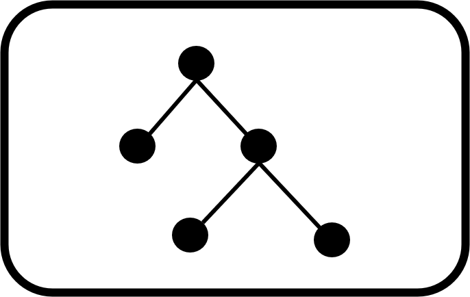
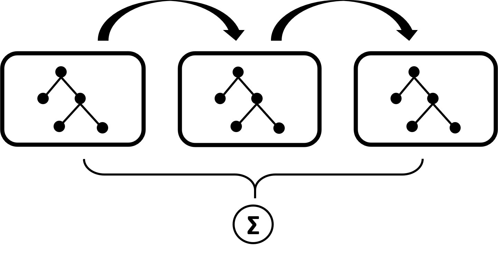
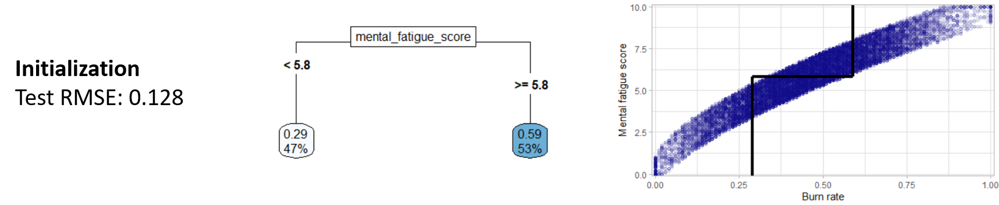
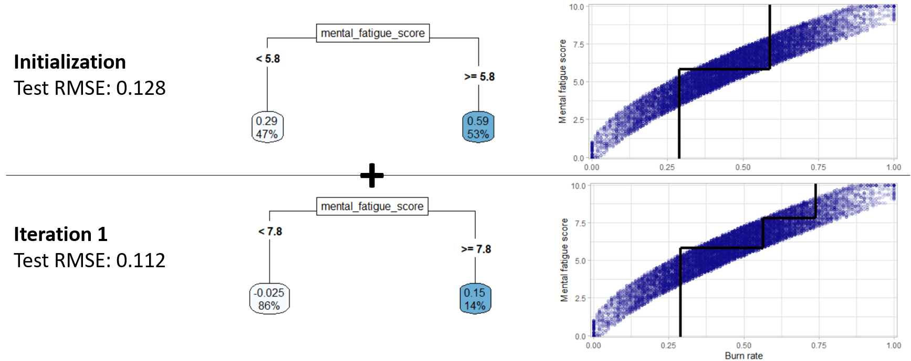
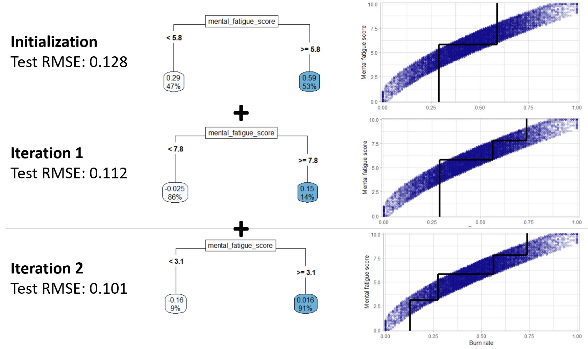
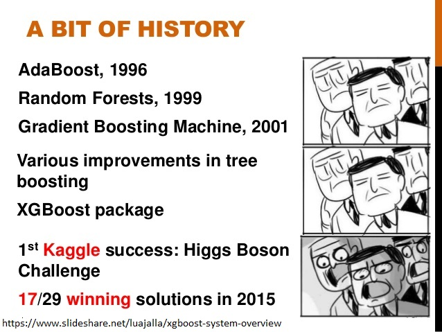

---
output:
  xaringan::moon_reader:
    self_contained: true
    lib_dir: libs
    css: xaringan-themer.css
    nature:
      highlightStyle: github
      highlightLines: true
      countIncrementalSlides: false
    includes:
      after_body: logo_placer.html
    seal: false
---
class: left, middle, inverse, hide-logo

```{r setup, include=FALSE}
options(htmltools.dir.version = FALSE)
```

```{r xaringan-themer, include=FALSE, warning=FALSE}
# Here the slides theme (TUM blue) is set and the fonts 
# feel free to change them
library(xaringanthemer)
style_mono_accent(
  base_color = "#0073C3",
  header_font_google = google_font("Josefin Sans"),
  text_font_google   = google_font("Montserrat", "300", "300i"),
  code_font_google   = google_font("Fira Mono")
)

### for rendering: 
# rmarkdown::render("_presentations/main_talk/main_talk.Rmd")
```


### Boosting methods for regression
<!-- 
English title page
-->

#### Emanuel Sommer
#### `r Sys.Date()`


<center>
<br><br><br>

<br>
<br>
Department of Mathematics
<br>
Technical University of Munich
</center>


---
## Basic Notation

Training data set:

$$\mathcal{D} = \{(y_i,x_i)\ | i \in [N]\}$$

Response: $y_i \in \mathbb{R}$ like the burnout rate or the charges.

Predictors: $x_i \in \mathbb{R}^m$

.pull-left[
.right[
$\textbf{y} = \begin{pmatrix}y_1\\ \vdots \\ y_N \end{pmatrix}$
]
]

.pull-right[
.left[
$\textbf{x} = \begin{pmatrix}x_1\\ \vdots \\ x_N \end{pmatrix}$
]
]

---
## Previously

.pull-left[
### CART

```{r, echo=FALSE, out.width="45%", fig.align='center'}

```

Let $\mathcal{T}$ be the space of CART models.

$$t(x_i, \gamma, R) = \sum_{j=1}^J \gamma_j I(x_i \in R_j) \quad  t \in \mathcal{T}$$
with $R_j$ being distinct regions of the predictor space and $\gamma_j$ the prediction w.r.t. the region.
]

--

.pull-right[
### Random forest

```{r, echo=FALSE, out.width="70%", fig.align='center'}

```

Build many deep trees in parallel and average over the individual predictions. Randomness is induced to decorrelate the trees.

]
---
background-image: url("https://media.giphy.com/media/cRH5deQTgTMR2/giphy.gif")
background-size: cover
class: center, bottom, hide-logo

---

## The core idea of boosting

**Sequentially** build weak learners - here shallow trees - that are ultimately combined in an additive fashion. Each additional learner should improve the total model.

```{r, echo=FALSE, out.width="50%", fig.align='center'}

```

**The general additive model:**

$$\hat{y}_i = \phi(x_i) = \sum_{k=1}^{K} t_k(x_i), \quad t_k \in \mathcal{T}$$


---

## The fitting approach

To fit such a model one uses **Forward Stagewise Additive Modeling**.

* Given the current model $\phi_{k-1}(\textbf{x})$
* Add the tree $t_k$ with regions $R^{(k)}$ and leaf predictions $\gamma^{(k)}$
* The parameters of the current model are unchanged!

$$\phi_k(\textbf{x}) = \phi_{k-1}(\textbf{x}) + t_k(\textbf{x}, \gamma^{(k)}, R^{(k)})$$

Each additional tree should improve the overall model i.e. solve the following optimization problem:

$$(\gamma^{(k)},R^{(k)}) = argmin_{\gamma,R} \sum_{i=1}^N L(y_i, \phi_{k-1}(x_i) + t(x_i,\gamma,R))$$
where $L$ is a convex and differentiable loss function.

---

## Connection with Gradient descent

**General minimization problem:**

$$\textbf{s}_{opt} = argmin_\textbf{s} f(\textbf{s}) \quad \textbf{s} \in \mathbb{R}^N$$

Where $f$ is differentiable and $\lambda \in \mathbb{R}$ a scalar.

**Gradient descent in a nutshell:**

$$
\textbf{s}^{(k)} = \textbf{s}^{(k-1)} - \lambda \bigg[\frac{\partial f(\textbf{s})}{\partial \textbf{s}}\bigg]_{\textbf{s}=\textbf{s}^{(k-1)}}
$$

For now set $\lambda = 1$.

---
## Connection with Gradient descent

.pull-left[
**General minimization setup:**

$$\textbf{s}_{opt} = argmin_\textbf{s} f(\textbf{s}) \quad \textbf{s} \in \mathbb{R}^N$$

<br>

Gradient descent:

$$
\textbf{s}^{(k)} = \textbf{s}^{(k-1)} - \bigg[\frac{\partial f(\textbf{s})}{\partial \textbf{s}}\bigg]_{\textbf{s}=\textbf{s}^{(k-1)}}
$$
]

.pull-right[
**The boosting setup:**

$$\phi_{opt} = argmin_{\phi} \sum_{i=1}^N L(y_i, \phi(x_i))$$


<br>

$$\phi_k(\textbf{x}) = \phi_{k-1}(\textbf{x}) + t_k(\textbf{x}, \gamma^{(k)}, R^{(k)})$$
]

Corresponding parts:

* The loss function $L$ to the function $f$
* The predictions $\phi_k(\textbf{x})$ to the input $s^{(k)}$
* The predictions of the tree $t_k$ to the negative gradient of $f$

---

## Tree-based gradient boosting

**Algorithm:**

**1.**  Initialize $\phi_0(\textbf{x})$ as a singular node tree.


<br>

**Example:** 

Burnout data with the RMSE loss, fixed $K = 2$ and tree depth 1.

<br>

```{r, echo=FALSE, out.width="95%", fig.align='center'}

```


---
## Tree-based gradient boosting

**2.**  For each tree addition $k = 1$ to $K$ do:

- For each observation $i = 1$ to $N$ compute:
  
    $g^{(k)}_{i} = \bigg[\frac{\partial L(y_i, \phi(x_i))}{\partial\phi(x_i)}\bigg]_{\phi = \phi_{k-1}}$

- Fit a regression tree by least squares to the outcome vector $-\textbf{g}^{(k)}$ in order to get the $J^{(k)}$ distinct regions $\tilde{R}^{(k)}_j$.

- For each of these $J^{(k)}$ regions perform a line search in order to compute the leaf predictions $\tilde{\gamma}^{(k)}_{j}$.

- Set $\phi_k(\textbf{x}) = \phi_{k-1}(\textbf{x}) + t(\textbf{x},\tilde {\gamma}^{(k)}_{j},\tilde{R}^{(k)}_j)$ with $t \in \mathcal{T}$

```{r, echo=FALSE, out.width="95%", fig.align='center', eval=FALSE, include=FALSE}

```
<!--
## Which loss to pick?

### $L_2$ loss

`r emo::ji("minus")` Sensitive to outliers.

`r emo::ji("plus")` Simplifications possible as the gradient is the residuals.

.pull-left[
### Alternatives

* $L_1$ loss
* Huber loss
]

.pull-right[
### Comparison

```{r, echo=FALSE, out.width="90%", fig.align='left'}
knitr::include_graphics(paste0(dirname(dirname(getwd())),"/_pictures/huber_loss.png"))
```

]
-->

---
## The example continued 

```{r, include=FALSE, eval=FALSE}
library(tidyverse)
library(tidymodels)
library(viridis)
burnout_data <- read_csv(paste0(dirname(dirname(getwd())),"/_data/burn_out_train.csv"))
# convert colnames to snake_case
colnames(burnout_data) <- tolower(
  stringr::str_replace_all(
    colnames(burnout_data),
    " ",
    "_"
  ))
# omit missing values in the outcome variable
burnout_data <- na.omit(burnout_data) %>%
  mutate(across(where(is.character), as.factor))
set.seed(2)
burnout_split <- rsample::initial_split(burnout_data, prop = 0.80)
burnout_train <- rsample::training(burnout_split)
burnout_test  <- rsample::testing(burnout_split)
remove(burnout_data)
remove(burnout_split)

library(rpart)
library(rpart.plot)
iter1_model <- decision_tree(tree_depth = 1) %>%
  set_engine("rpart") %>%
  set_mode("regression")
iter2_model <- iter1_model
iter3_model <- iter1_model

# first model
iter1_model_fit <- iter1_model %>%
  fit_xy(x = burnout_train[,3:8], y = burnout_train$burn_rate)


iter1_rmse <- rmse_vec(truth = burnout_test$burn_rate,
                       estimate = predict(iter1_model_fit,
                        new_data = burnout_test)[[".pred"]])
iter1_resid <- burnout_train$burn_rate - predict(iter1_model_fit,
                                                 new_data = burnout_train)
# second model
iter2_model_fit <- iter2_model %>%
  fit_xy(x = burnout_train[,3:8], y = iter1_resid)

iter2_rmse <- rmse_vec(truth = burnout_test$burn_rate,
                       estimate = predict(iter1_model_fit,
                        new_data = burnout_test)[[".pred"]] +
                         predict(iter2_model_fit,
                        new_data = burnout_test)[[".pred"]])

iter2_resid <- burnout_train$burn_rate - 
  predict(iter1_model_fit, new_data = burnout_train) -
  predict(iter2_model_fit, new_data = burnout_train)

# third model
iter3_model_fit <- iter3_model %>%
  fit_xy(x = burnout_train[,3:8], y = iter2_resid)


iter3_rmse <- rmse_vec(truth = burnout_test$burn_rate,
                       estimate = predict(iter1_model_fit,
                        new_data = burnout_test)[[".pred"]] +
                         predict(iter2_model_fit,
                        new_data = burnout_test)[[".pred"]] +
                         predict(iter3_model_fit,
                        new_data = burnout_test)[[".pred"]])


```


```{r, echo=FALSE, out.width="95%", fig.align='center'}

```


```{r,echo=FALSE, fig., eval=FALSE, include=FALSE}
rpart.plot(iter1_model_fit$fit, type = 5, roundint = F)
```

```{r, echo=FALSE, eval=FALSE, include=FALSE}
rpart.plot(iter2_model_fit$fit, type = 5, roundint = F)
```

```{r, echo=FALSE, eval=FALSE, include=FALSE}
rpart.plot(iter3_model_fit$fit, type = 5, roundint = F)
```

```{r, echo=FALSE, eval=FALSE, include=FALSE}
ggplot(burnout_train,
       aes(y = mental_fatigue_score,
           x = burn_rate)) +
  # geom_rect(aes(xmin = -0.01, ymin = 5.8,
  #               xmax = 1.01, ymax = 10.1),
  #           fill = "#858585",
  #           alpha = 0.01) +
  scale_x_continuous(expand = c(0, 0),
                     limits = c(-0.01, 1.01)) +
  scale_y_continuous(expand = c(0, 0),
                     limits = c(-0.1, 10.1)) +
  geom_point(alpha = 0.1, col = plasma(1),
             na.rm = TRUE) +
  geom_segment(aes(x = 0.29, y = 5.8, yend = 5.8, xend = 0.59),
               inherit.aes = FALSE,
               size = 1.5) +
  geom_segment(aes(x = 0.59, y = 5.8, yend = 10.1, xend = 0.59),
               inherit.aes = FALSE,
               size = 1.5) +
  geom_segment(aes(x = 0.29, y = -0.1, yend = 5.8, xend = 0.29),
               inherit.aes = FALSE,
               size = 1.5) +
  labs(y = "Mental fatigue score", x = "Burn rate",
       title = "**Model predictions**",
       subtitle = "Iteration: Initialization") +
  theme_light() +
  theme(legend.position = "None",
        plot.title = ggtext::element_markdown(size = 11))
```

```{r, echo=FALSE, eval=FALSE, include=FALSE}
ggplot(burnout_train,
       aes(y = mental_fatigue_score,
           x = burn_rate)) +
  # geom_rect(aes(xmin = -0.01, ymin = 5.8,
  #               xmax = 1.01, ymax = 7.8),
  #           fill = plasma(5)[5],
  #           alpha = 0.01) +
  scale_x_continuous(expand = c(0, 0),
                     limits = c(-0.01, 1.01)) +
  scale_y_continuous(expand = c(0, 0),
                     limits = c(-0.1, 10.1)) +
  # second tree region
  # geom_rect(aes(xmin = -0.01, ymin = 7.8,
  #               xmax = 1.01, ymax = 10.1),
  #           fill = plasma(5)[5],
  #           alpha = 0.02) +
  geom_point(alpha = 0.1, col = plasma(1),
             na.rm = TRUE) +
  geom_segment(aes(x = 0.29, y = 5.8, yend = 5.8, xend = 0.565),
               inherit.aes = FALSE,
               size = 1.5) +
  geom_segment(aes(x = 0.565, y = 7.8, yend = 7.8, xend = 0.74),
               inherit.aes = FALSE,
               size = 1.5) +
  geom_segment(aes(x = 0.74, y = 7.8, yend = 10.1, xend = 0.74),
               inherit.aes = FALSE,
               size = 1.5) +
  geom_segment(aes(x = 0.565, y = 5.8, yend = 7.8, xend = 0.565),
               inherit.aes = FALSE,
               size = 1.5) +
  geom_segment(aes(x = 0.29, y = -0.1, yend = 5.8, xend = 0.29),
               inherit.aes = FALSE,
               size = 1.5) +
  labs(y = "Mental fatigue score", x = "Burn rate",
       title = "**Model predictions**",
       subtitle = "Iteration: 1") +
  theme_light() +
  theme(legend.position = "None",
        plot.title = ggtext::element_markdown(size = 11))
```


```{r, echo=FALSE, eval=FALSE, include=FALSE}
ggplot(burnout_train,
       aes(y = mental_fatigue_score,
           x = burn_rate)) +
  # geom_rect(aes(xmin = -0.01, ymin = 5.8,
  #               xmax = 1.01, ymax = 7.8),
  #           fill = plasma(5)[5],
  #           alpha = 0.005) +
  scale_x_continuous(expand = c(0, 0),
                     limits = c(-0.01, 1.01)) +
  scale_y_continuous(expand = c(0, 0),
                     limits = c(-0.1, 10.1)) +
  # # second tree region
  # geom_rect(aes(xmin = -0.01, ymin = 7.8,
  #               xmax = 1.01, ymax = 10.1),
  #           fill = plasma(5)[5],
  #           alpha = 0.01) +
  # # third tree region
  # geom_rect(aes(xmin = -0.01, ymin = 3.1,
  #               xmax = 1.01, ymax = 5.8),
  #           fill = plasma(5)[5],
  #           alpha = 0.0025) +
  geom_point(alpha = 0.1, col = plasma(1),
             na.rm = TRUE) +
  geom_segment(aes(x = 0.274, y = 5.8, yend = 5.8, xend = 0.565),
               inherit.aes = FALSE,
               size = 1.5) +
  geom_segment(aes(x = 0.565, y = 7.8, yend = 7.8, xend = 0.74),
               inherit.aes = FALSE,
               size = 1.5) +
  geom_segment(aes(x = 0.13, y = 3.1, yend = 3.1, xend = 0.274),
               inherit.aes = FALSE,
               size = 1.5) +
  geom_segment(aes(x = 0.74, y = 7.8, yend = 10.1, xend = 0.74),
               inherit.aes = FALSE,
               size = 1.5) +
  geom_segment(aes(x = 0.565, y = 5.8, yend = 7.8, xend = 0.565),
               inherit.aes = FALSE,
               size = 1.5) +
  geom_segment(aes(x = 0.274, y = 3.1, yend = 5.8, xend = 0.274),
               inherit.aes = FALSE,
               size = 1.5) +
  geom_segment(aes(x = 0.13, y = -0.1, yend = 3.1, xend = 0.13),
               inherit.aes = FALSE,
               size = 1.5) +
  labs(y = "Mental fatigue score", x = "Burn rate",
       title = "**Model predictions**",
       subtitle = "Iteration: 2") +
  theme_light() +
  theme(legend.position = "None",
        plot.title = ggtext::element_markdown(size = 11))
```


---
## Combat Overfitting

### Early stopping

Monitor the loss on one or many (CV) validation sets and stop the addition of trees when the validation loss increases.

--

### Shrinkage

Introduce a learning rate $\eta$ that scales the contribution of the new model. 

$$\phi_k(\textbf{x}) = \phi_{k-1}(\textbf{x}) + \eta * t(\textbf{x},\tilde {\gamma}^{(k)}_{j},\tilde{R}^{(k)}_j)$$

--

### Subsampling

**Row-subsampling:** In each step use only a fraction of the training data.

**Column-subsampling:** In each step use only a fraction of the training features.


```{r, echo=FALSE, out.width="80%", fig.align='center', eval=FALSE, include=FALSE}

```

---

## An implementation: XGBoost

<br>
<center>
** A highly scalable end-to-end tree boosting system.**
</center>
<br>


* Strong regularization
  - Lasso/ Ridge penalization on $\gamma$ 
  - Shrinkage `r emo::ji("heavy_check_mark")`
  - Subsampling `r emo::ji("heavy_check_mark")`
  - Early stopping `r emo::ji("heavy_check_mark")`
  - Maximum tree depth `r emo::ji("heavy_check_mark")`
* Parallelized tree building 
* Extremely efficient on sparse data and can handle missing values by having learned default directions in each split
* Cache aware algorithm

Also very popular in R: `gbm` package. (Same functionality: `r emo::ji("heavy_check_mark")`)

<!-- 
## XGBoost vs overfitting 

### Regularized Loss

$$\mathcal{L}(\phi) = L(\phi) + \sum_{k=1}^K \Omega_{\alpha, \lambda, \nu}(t_k)$$


Where $\Omega_{\alpha, \lambda, \nu}$ is the penalizing term for model complexity.


* $\alpha$ is a $L_1$ regularization parameter on $\gamma$.
* $\lambda$ is a $L_2$ regularization parameter on $\gamma$.
* $\nu$ is the minimal loss reduction for terminal partitions.
* Second order approximations of the loss allow for better parallelization.


.pull-left[
### Shrinkage

### Subsampling
]

.pull-right[
### Early stopping

### Maximum tree depth
]
-->
---
background-image: url("https://media.giphy.com/media/BpGWitbFZflfSUYuZ9/giphy.gif")
background-size: cover
class: center, bottom, hide-logo


---
## Burnout data set

**Goal:** Predict the burnout rate of an employee.

.left-column[
<br>

**Number of predictors:** 

9

**Training data:** 

17301 rows

**Test data:** 

4325 rows

**Missing:**

14%
]

.right-column[
```{r, echo=FALSE, out.width="90%", fig.align='center'}
knitr::include_graphics(paste0(dirname(dirname(getwd())),"/_pictures/burn_rate_raw_nojitter.png"))
```
]
---

## Transformed outcome

The transformation with the empirical logit removes the bounds on the target.

$$log(\frac{x+0.5}{1-x+0.5})$$

```{r, echo=FALSE, out.width="65%", fig.align='center'}
knitr::include_graphics(paste0(dirname(dirname(getwd())),"/_pictures/burn_rate_trans_nojitter.png"))
```

<!--
## Mental fatigue score

```{r, echo=FALSE, out.width="70%", fig.align='center'}
knitr::include_graphics(paste0(dirname(dirname(getwd())),"/_pictures/mfs_main.png"))
```

Proposed baseline model:

$$
\text{burn_rate}_i = \beta_0 + \beta_1 \text{ mental_fatigue_score}_i + \epsilon_i \quad \text{with }
\epsilon_i \sim N(0,\sigma^2)
$$
-->

<!--
## Two closely related features

<br>

```{r, echo=FALSE, out.width="80%", fig.align='center'}
knitr::include_graphics(paste0(dirname(dirname(getwd())),"/_pictures/designationVsRessources.png"))
```

Both features show relevant main effects.
-->
---
## Prepare for takeoff

### Pre-processing / Feature Engineering

* All variables are used without normalization.
* Extract extra features `day of the week` and `month` of the date of joining.
* Dummy-encoding of all nominal variables.

--

### Resampling

**5-fold cross validation** is used for model evaluation e.g. hyperparameter tuning.

```{r, echo=FALSE, out.width="70%", fig.align='center'}

```

---
## Tuning strategy

**1.** `#Trees`

Fix all other hyperparameters to default values and the learning rate rather small to determine $K \in [100,2000]$ to minimize the validation loss. 

**2.** `Tree and the basic regularization hyperparameters`

.pull-left[
`Learning rate`: $\eta \in [1e^{-10},0.1]$

`Max tree depth`: $max(J^{(k)}) \in [1,15]$

`Loss reduction`: $\nu \in [1e^{-10},30]$
]

.pull-right[
`Column-subsampling`: $[1,\text{#features}]$

`Row-subsampling`:  $[0.1,1]$
]

Evaluate a set of combinations of these and determine the combinations that again minimize the validation loss. (Set of combinations: space-filling design)

**3.** Refine the set of combinations and repeat 2. to find the final combination.

<!--
.footnote[[*] Hastie, T., Tibshirani, R. and Friedman, J. (2009). The elements of statistical learning (12th printing). Springer New York.]
-->

---
## Tuning the number of trees

<br>

```{r, echo=FALSE, out.width="80%", fig.align='left'}
knitr::include_graphics(paste0(dirname(dirname(getwd())),"/_pictures/burn_boost_tune_first.png"))
```

`r emo::ji("backhand index pointing right")` Fix 1500 trees.


---
## Space-filling grid search

Tuning both the model with the raw outcome and the transformed one with space-filling grids came at a cost: **8 hours** of parallel computation.

<br>

**The final parameters:**

.pull-left[
`#Trees`: 1500

`Max tree depth`: 4

`Learning rate`: 0.02
]

.pull-right[
`Loss reduction`: roughly 0

`Column-subsampling`: not enabled

`Row-subsampling`:  80%
]

---
## Raw vs transformed target

The two models behaved exactly the same while tuning and show no notable differences in any of the following visualizations so the focus will now be on the raw model.

```{r, echo=FALSE, out.width="70%", fig.align='left'}
knitr::include_graphics(paste0(dirname(dirname(getwd())),"/_pictures/bout_raw_vs_trans.png"))
```

---
## Feature importance

The feature importance is basically the gain w.r.t. the loss of the feature over all splits.

```{r, echo=FALSE, out.width="80%", fig.align='left'}
knitr::include_graphics(paste0(dirname(dirname(getwd())),"/_pictures/vip_burn.png"))
```

---
## Handling of missing values

```{r, echo=FALSE, out.width="75%", fig.align='left'}
knitr::include_graphics(paste0(dirname(dirname(getwd())),"/_pictures/miss_vals_burn2.png"))
```

The default directions of XGBoost seem to work well.

---
## Final performance

```{r, echo=FALSE, out.width="80%", fig.align='left'}
knitr::include_graphics(paste0(dirname(dirname(getwd())),"/_pictures/final_perf_burn.png"))
```

---

## Insurance data set

**Goal:** Predict the medical costs (Charges) billed by health insurance.

.left-column[
<br>

**Number of predictors:** 

6

**Training data:** 

1071 rows

**Test data:** 

267 rows

**Missing:**

None
]


.right-column[
```{r, echo=FALSE, out.width="90%", fig.align='center'}
knitr::include_graphics(paste0(dirname(dirname(getwd())),"/_pictures/charges_ins_nojitter.png"))
```
]

---
## Fitting and tuning

- Again all variables are used without normalization.
- Dummy-encoding of all nominal variables.
- Resampling setup with 5-fold CV is the same.
- The tuning strategy and ranges are unchanged.
- The tuning w.r.t. the number of trees resulted in a value of 600.
- The space-filling grid search over the remaining 5 hyperparameters took 30 minutes in total.

**The final parameters:**

.pull-left[
`#Trees`: 600

`Max tree depth`: 3

`Learning rate`: 0.02
]

.pull-right[
`Loss reduction`: 0.03

`Column-subsampling`: 7 of 8

`Row-subsampling`:  80%
]

--
<!--
<br>
.center[

]
-->

<!--
## Tuning the number of trees

```{r, echo=FALSE, out.width="90%", fig.align='center'}
knitr::include_graphics(paste0(dirname(dirname(getwd())),"/_pictures/boost_ins_tune_plot1.png"))
```

So a closer look at the region around 500 is advisable.

## Tuning the number of trees

```{r, echo=FALSE, out.width="90%", fig.align='center'}
knitr::include_graphics(paste0(dirname(dirname(getwd())),"/_pictures/boost_ins_tune_plot2.png"))
```

`r emo::ji("backhand index pointing right")` Fix 600 trees.
-->
<!--
## A glimpse at learning rates

```{r, echo=FALSE, out.width="90%", fig.align='center'}
knitr::include_graphics(paste0(dirname(dirname(getwd())),"/_pictures/boost_ins_tune_lrate.png"))
```

Thus a too small learning rate can also be a problem.
-->

<!--
## Space-filling grid search


- 600 combinations.
- 900k trees.
- 30 minutes of parallel computation.

<br>

**The final parameters:**

.pull-left[
`#Trees`: 600

`Max tree depth`: 3

`Learning rate`: 0.02
]

.pull-right[
`Loss reduction`: 0.03

`Column-subsampling`: 7 of 8

`Row-subsampling`:  80%
]
-->

```{r, echo=FALSE,include=FALSE, out.width="90%", fig.align='center'}
knitr::include_graphics(paste0(dirname(dirname(getwd())),"/_pictures/tuning_ins_parallelcoord.png"))
```

<!--
`#Trees`: 600

`Max tree depth`: 3

`Learning rate`: 0.02

`Loss reduction`: 0.03

`Column-subsampling`: 7 of 8

`Row-subsampling`:  80%
-->

---
## Feature importance

```{r, echo=FALSE, out.width="90%", fig.align='left'}
knitr::include_graphics(paste0(dirname(dirname(getwd())),"/_pictures/vip_ins.png"))
```


---
## Final Performance


```{r, echo=FALSE, out.width="80%", fig.align='left'}
knitr::include_graphics(paste0(dirname(dirname(getwd())),"/_pictures/final_perf_ins.png"))
# final_ins <- dplyr::tribble(
#   ~model, ~rmse,
#   "XGBoost", 0.1678,
#   "Random Forest", 0.1766,
#   "Linear Model", 0.1795,
#   "Intercept Only", 0.3922
# )
# knitr::kable(final_ins)
```

---
## Pros 

- **Minimal pre-processing**

- **Flexible enough to detect complex non-linear patterns**

- **Handling of missing values**

- **Integrated feature selection**

- **Good generalization due to lots of regularization options**

- **Strong predictive power**

## Cons

- **Not easily explainable**

- **Computationally demanding (especially the hyperparameter tuning)**

- **Better if there are lots of observations**


---
class: inverse, center, middle, hide-logo


## Thank you and happy boosting!

Check out the bookdown project for more!


---
class: inverse, center, middle, hide-logo


## Discussion

---
## Interesting residuals

```{r, echo=FALSE, out.width="100%", fig.align='center'}
load(paste0(dirname(dirname(getwd())),"/_data/resid_data_ins.RData"))
resid_plot_ins_data %>%
  plotly::plot_ly(x = ~age, z = ~resid, y = ~bmi,
                  color = ~factor(smoker),
                  symbol = ~factor(smoker),
                  text = ~paste("Age:", age, "BMI:", bmi),
                  hoverinfo = "text",
                  symbols = c('x','circle'),
                  colors = plasma(3)[2:1]) %>%
  plotly::add_markers(opacity = 0.9,
                      size = 2) %>%
  plotly::layout(scene = list(
    xaxis = list(title = "Age"),
    yaxis = list(title = "BMI"),
    zaxis = list(title = "Raw residuals")),
    title = "Raw residuals of the insurance XGBoost model",
    legend = list(title = list(text = "Smoker")))
# library(emo)
# resid_plot_ins_data %>%
#   mutate(emoji = if_else(smoker == "yes",
#                          filter(jis, name == "cigarette")$emoji,
#                          filter(jis,
#                                 name == "smiling face with halo")$emoji)) %>%
#   plotly::plot_ly(x = ~age, z = ~resid, y = ~bmi,
#                   text = ~emoji,
#                   hovertext = ~paste("Age:", age, "BMI:", bmi),
#                   hoverinfo = "text") %>%
#   plotly::add_text(size = I(20)) %>%
#   plotly::layout(scene = list(
#     xaxis = list(title = "Age"),
#     yaxis = list(title = "BMI"),
#     zaxis = list(title = "Raw residuals")),
#     title = "Raw residuals of the insurance XGBoost model")
```


---
## R setup

.pull-left[
```{r, echo=FALSE, out.width="80%", fig.align='center'}
knitr::include_graphics("img/tidyverse_hex.png")
```
]
.pull-right[
```{r, echo=FALSE, out.width="80%", fig.align='center'}
knitr::include_graphics("img/tidymodels_hex.png")
```
]

<br>
Amazing book: **Tidy modeling with R**

---
## Compressed tree visualization 

```{r, echo=FALSE, out.width="90%", fig.align='left'}
knitr::include_graphics(paste0(dirname(dirname(getwd())),"/_pictures/ins_multitree_xgb.png"))
```

